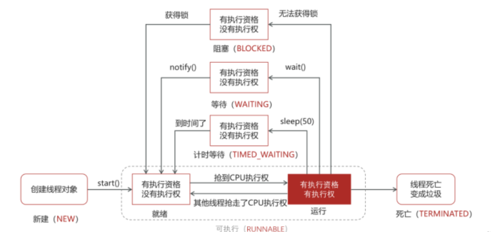

在应用程序中，将**多个程序块同时运行**的现象称为**并发执行**。**多线程**是指一个应用程序中有**多条并发执行**的线索，每条线索被称为一个**线程**。它们交替执行，彼此间可以进行通信。

## 1 线程与进程

一台计算机可以同时执行多个程序，而这**每个运行中的程序**都是**一个进程**，每个进程都拥有相对**独立的执行环境**。进程时程序的实例，时操作系统动态执行的**基本单元**。

**进程**的实质是程序在多到程序系统中的**一次执行过程**，但进程中的**实际运作单位是线程**。线程是操作系统能够进行运算调度的最小单位，它被包含在进程之中。**一个进程中至少存在一个线程**，每一个线程都是进程中一个单一顺序的控制流。

**多线程程序**是指程序中实现多段程序代码**交替运行**的效果。创建线程的方式有以下3种：

- 继承`Thread`类
- 实现`Runnable`接口
- 基于`Callable`接口和`Future`类

**接下来实现判断指定列表中年份的平闰年**

#### 1.1 继承 Thread 类创建

编写多线程程序，需要在程序中创建并启动**除主线程之外**的**其他线程**，Java中使用`Thread`类来代表线程，所有的**线程对象**都必须是`Thread`类或其子类的实例。`Thread`类用于**分配线程对象的构造方法**：

| 方法声明                                  | 说明                                   |
| ------------------------------------- | ------------------------------------ |
| `Thread()`                            | 创建一个线程对象                             |
| `Thread(String name)`                 | 创建一个名称为name的线程对象                     |
| `Thread(Runnable target)`             | 根据任务对象target创建一个线程对象                 |
| `Thread(Runnable target,String name)` | 根据任务对象target创建一个线程对象，并指定线程对象的名称为name |
>[!warning] 注意
>若未指定线程名字，程序会自动为线程分配格式为 `Thread-n` 的名称，n为非负整数的数字。

Thread类提供的常用于**操作线程**的方法如下：

| 方法声明                             | 说明                   |
| -------------------------------- | -------------------- |
| `String getName()`               | 获取当前线程的名称            |
| `void setName(String name)`      | 将当前线程的名称更改为参数name    |
| `void start()`                   | 启动一个新线程              |
| `void run()`                     | 线程的执行方法，是线程执行的主体     |
| `static void sleep(long millis)` | 使当前正在执行的线程休眠millis毫秒 |
>[!warning] 注意事项
>1. `start()`方法用于**启动一个新线程**，但是该方法本身**并不是执行线程代码**的方法。`start()`方法只能告诉JVM该线程已准备好被执行，并由JVM来负责调度和执行；
>2. 当线程获得了CPU时间片后，就会调用该线程的`run()`方法，该方法是线程的**执行方法**，其中包含线程的**主要执行逻辑**；
>3. 若直接调用`run()`方法，则该方法**并不会启动线程**，只是在**当前线程**中执行了`run()`方法中的代码而已。

**通过Thread类创建线程步骤**：

1. 首先定义通用的闰年判断规则：
```java
public class LeapYearUtil {  
    /**  
     * 判断单个年份是否为闰年  
     * 规则：能被4整除但不能被100整除，或能被400整除  
     */  
    public static boolean isLeapYear(int year) {  
        return (year % 4 == 0 && year % 100 != 0) || (year % 400 == 0);  
    }  
}
```

2. 定义`Thread`类的子类，并重写Thread类的`run()`方法，在`run()`方法中定义线程要执行的任务；

```java
// 单个年份的闰年判断线程  
class LeapYearThread extends Thread {  
    private int year;  
  
    public LeapYearThread(int year) {  
        this.year = year;  
    }  
  
    @Override  
    public void run() {  
        boolean result = LeapYearUtil.isLeapYear(year);  
        System.out.printf("线程[%s]：年份%d %s闰年%n",  
                Thread.currentThread().getName(), year, result ? "是" : "不是");  
    }  
}
```

>[!bug] 异常处理
>`sleep()`可能导致`InterruptedException`异常！

3. 创建Thread子类的实例，即创建**线程对象**；
4. 调用线程对象的`start()`的方法启动线程。

```java
// 测试类  
public class LeapYearThreadDemo {  
    public static void main(String[] args) {  
        // 待判断的年份数组  
        int[] years = {2000, 2020, 2024, 1900, 2025};  
  
        // 为每个年份创建线程并启动  
        for (int year : years) {  
            new LeapYearThread(year).start();  
        }  
    }  
}
```

运行结果：

```
线程[Thread-0]：年份2000 是闰年
线程[Thread-1]：年份2020 是闰年
线程[Thread-4]：年份2025 不是闰年
线程[Thread-3]：年份1900 不是闰年
线程[Thread-2]：年份2024 是闰年
```

#### 1.2 实现 Runnable 接口创建

Java是**单继承**，因此若继承其他父类时将无法通过继承 `Thread` 类进行创建线程，因此，可以借助`Thread`类提供的`Thread(Runnable target)` 或 `Thread(Runnable target, String name)`构造方法来创建线程，其中`Runnable`接口的实例代表一个需要执行的具体任务，通常被称为**任务对象**，`Runnable`接口只包含一个`run()`方法，用于**定义线程的执行代码**。

**通过实现Runnable接口创建多线程的步骤**：

1. 首先定义通用的闰年判断规则：

```java
public class LeapYearUtil {  
    /**  
     * 判断单个年份是否为闰年  
     * 规则：能被4整除但不能被100整除，或能被400整除  
     */  
    public static boolean isLeapYear(int year) {  
        return (year % 4 == 0 && year % 100 != 0) || (year % 400 == 0);  
    }  
}
```

2. 定义`Runnable`接口的实现类，并重写该接口`run()`方法；

```java
// 闰年判断任务（实现Runnable）  
class LeapYearTask implements Runnable {  
    private int year;  
  
    public LeapYearTask(int year) {  
        this.year = year;  
    }  
  
    @Override  
    public void run() {  
        boolean result = LeapYearUtil.isLeapYear(year);  
        System.out.printf("线程[%s]：年份%d %s闰年%n",  
                Thread.currentThread().getName(), year, result ? "是" : "不是");  
    }  
}
```

3. 创建`Runnable`实现类的实例，并将实例作为`Thread`的任务对象**创建Thread对象**；
4. 调用线程对象的`start()`方法启动线程。

```java
// 测试类  
public class LeapYearRunnableDemo {  
    public static void main(String[] args) {  
        int[] years = {2000, 2020, 2024, 1900, 2025};  
  
        // 为每个任务分配线程  
        for (int year : years) {  
            Thread thread = new Thread(new LeapYearTask(year));  
            thread.start();  
        }  
    }  
}
```

运行结果：

```
线程[Thread-0]：年份2000 是闰年
线程[Thread-4]：年份2025 不是闰年
线程[Thread-2]：年份2024 是闰年
线程[Thread-3]：年份1900 不是闰年
线程[Thread-1]：年份2020 是闰年
```

#### 1.3 实现 Callable 接口创建

通过实现`Runnable`接口创建线程时，将重写的`run()`方法包装成**线程执行体**，由于`run()`方法**没有返回值**，因此如果线程执行结果需要返回值时，实现`Runnable`接口的方式将不适用。此时，可使用`Callable`接口，该接口的`call()`方法可以作为线程的执行体，并且**有返回值**。

>[!warning] 提示
>`Callable`对象不能直接作为`Thread`构造方法的`target`参数，需要借助`FutureTask`类创建对应的参数对象，`FutureTask`类提供的构造方法可以传入一个`Callable`对象对其封装起来，作为创建`Thread`对象时的`target`参数值。当线程执行时，`FutureTask`内部会执行`Callable`对象的`call()`方法，并将结果存储在`FutureTask`中。

`Future`接口管理线程的5个方法：

| 方法声明                                            | 功能描述                                                                                 |
| ----------------------------------------------- | ------------------------------------------------------------------------------------ |
| `boolean cancel(boolean mayInterruptIfRunning)` | 用于尝试取消任务，参数`mayInterruptIfRunning`表示**是否允许取消正在执行却没有执行完毕的任务**，如果设置true，则表示可以取消正在执行的任务 |
| `boolean isCancelled()`                         | 判断任务是否被取消，如果被取消返回true，否则返回false                                                      |
| `boolean isDone()`                              | 判断任务是否已经完成，如果任务完成返回true，否则返回false                                                    |
| `V get()`                                       | 用于获取执行结果，这个方法**会发生阻塞**，一直等到任务行完毕才返回执行结果                                              |
| `V get(long timeout, TimeUnit unit)`            | 用于在指定时间内获取执行结果，如果在指定时间内无法获取到结果则抛出异常                                                  |
**基于Callable和FutureTask创建线程的步骤：**

1. 首先定义通用的闰年判断规则：

```java
public class LeapYearUtil {  
    /**  
     * 判断单个年份是否为闰年  
     * 规则：能被4整除但不能被100整除，或能被400整除  
     */  
    public static boolean isLeapYear(int year) {  
        return (year % 4 == 0 && year % 100 != 0) || (year % 400 == 0);  
    }  
}
```

2. 创建`Callable`接口的实现类；

```java
import java.util.concurrent.Callable;  
  
// 带返回值的闰年判断任务  
class LeapYearCallable implements Callable<String> {  
    private int year;  
  
    public LeapYearCallable(int year) {  
        this.year = year;  
    }  
  
    @Override  
    public String call() throws Exception {  
        boolean result = LeapYearUtil.isLeapYear(year);  
        // 返回任务结果（自定义格式）  
        return String.format("年份【%d】：%s闰年", year, result ? "是" : "不是");  
    }  
}
```

3. 创建包装了`Callable`对象的`FutureTask`类；
4. 使用`FutureTask`对象作为Thread对象的target参数并启动线程。

```java
import java.util.concurrent.FutureTask;

public class LeapYearFutureTaskDemo {  
    public static void main(String[] args) throws Exception {  
        // 待判断的年份数组  
        int[] years = {2000, 2020, 2024, 1900, 2025};  
  
        for (int year : years) {  
            // 1. 创建Callable任务对象  
            Callable<String> callable = new LeapYearCallable(year);  
  
            // 2. 用FutureTask包装Callable（FutureTask实现了RunnableFuture接口）  
            FutureTask<String> futureTask = new FutureTask<>(callable);  
  
            // 3. 创建线程并启动（FutureTask作为Runnable传入Thread）  
            Thread thread = new Thread(futureTask, "闰年判断线程-" + year);  
            thread.start();  
  
            // 4. 获取任务结果（get()会阻塞直到任务完成）  
            String result = futureTask.get();  
            System.out.println("线程[" + thread.getName() + "]结果：" + result);  
        }  
    }  
}
```

运行结果：

```
线程[闰年判断线程-2000]结果：年份【2000】：是闰年
线程[闰年判断线程-2020]结果：年份【2020】：是闰年
线程[闰年判断线程-2024]结果：年份【2024】：是闰年
线程[闰年判断线程-1900]结果：年份【1900】：不是闰年
线程[闰年判断线程-2025]结果：年份【2025】：不是闰年
```

| 创建方式                  | 优点                                                             | 缺点                                                                       |
| --------------------- | -------------------------------------------------------------- | ------------------------------------------------------------------------ |
| 继承Thread类             | 编码相对简单                                                         | 1. 存在单继承的局限性，不便于扩展<br/>2. 不能返回线程执行的结果<br/>3. 每个线程的任务和线程本身是耦合的，无法将任务和线程分离 |
| 实现Runnable接口          | 1. 可以继续继承类和实现接口，扩展性强<br/>2. 任务和线程分离，可以实现多个线程共享同一个任务            | 编码相对复杂，不能返回线程执行的结果                                                       |
| 基于Callable和FutureTask | 1. 线程任务类只是实现接口，可以继续继承类和实现接口，扩展性强。<br/>2. 可以在线程执行完毕后去获取线程执行的结果。 | 编码相对复杂                                                                   |
## 2 线程生命周期

线程生命周期的**六种基本状态**：

- 新建状态
- 可运行状态
- 阻塞状态
- 无限等待状态
- 计时等待状态
- 被终止状态

#### 2.1 新建状态 

创建一个线程对象，但还没调用**start()方法**启动线程，该线程就处于**新建状态**。此时，新建状态的线程和其他声明但未赋值的Java对象类似，JVM**仅为其分配了内存**，并没有表现出任何**线程的动态特征**。 

#### 2.2 可运行状态 

当线程对象调用了**start()方法**后就进入**可运行状态**，也称为**就绪状态**。处于可运行状态的线程位于**线程队列**中，此时它只是具备了运行的**条件**，要获得**CPU的使用权**并开始运行，还需要等待系统的**调度**。 

#### 2.3 阻塞状态 

如果处于**可运行状态**的线程获得了**CPU的使用权**，并开始执行**run()方法**中的线程执行体，则线程**处于运行状态**。 一个线程启动后，它可能不会一直处于运行状态，当一个线程试图获取一个**对象锁**，而该对象锁被**其他的线程**持有时，则该线程进入**阻塞状态**。当其他线程**释放对象锁**，该线程获得对象锁时，该线程将重新变成**可运行状态**。 

#### 2.4 无限等待状态 

一个线程在等待另一个线程执行一个**唤醒**动作时，该线程进入**无限等待状态**。线程进入这个状态后是不能**自动唤醒**的，必须等待另一个线程**调用notify()方法或者notifyAll()方法**才能够唤醒。 

#### 2.5 计时等待状态 

计时等待状态是指线程在调用了具有指定等待时间的方法后而进入的状态，这些方法包括**Thread类的sleep()方法和join()方法、Object类的wait()方法、LockSupport类的parkNanos()方法、LockSupport.parkUntil()** 等。 当线程调用这些方法并指定了等待时间，它就会进入**计时等待状态**，这一状态将一直保持到**超时**或者接收到**唤醒通知**。

#### 2.6被终止状态 

被终止状态是终止运行的线程的状态。线程因为**run()方法**正常退出，或者线程抛出一个**未捕获的异常(Exception)或者错误(Error)** 时终止了**run()方法**而结束执行。

在多线程程序中，CPU会在多个线程之间**切换执行**，因此，线程的状态会在**可运行**和**阻塞**之间切换，通过一些操作也可以使线程在**不同状态之间转换**。



## 3 线程同步

**线程同步**指在一个多线程程序中，当一个线程在对内存中的**共享数据**进行操作时，**其他线程**无法对该**共享数据**进行操作的机制。该机制可以**确保多个线程按照特定顺序正确执行**，从而保证在多线程环境下共享资源的**安全访问**和**正确性**。

>[!bug] 提示
>1. 当程序中的线程**不同步**时，可能会导致线程出现**安全问题**
>2. 由于线程调度具有一定的**随机性**，当多个线程**同时**访问和操作**同一个共享资源**时，很容易出现偶然的**线程安全问题**

>[!faq] 什么是线程安全问题？
>指多线程环境中，多个线程**同时**访问共享数据，如果没有适当的**同步保护机制**保护共享数据，导致程序可能出现**不正确**或**不符合预期**的结果

#### 3.1 案例：银行取钱

**通过一个实例进行理解——银行取钱**。银行取钱的基本流程：

1. 用户输入取款金额；
2. 银行判断账户余额是否大于取款金额；
3. 若余额大于取款金额，则取款成功，否则失败。

实现步骤：
1）定义账户类Account，该类中包含账户编号和账户余额两个属性，以及取钱的方法；

```java
public class Account {  
    private String cardId;  
    private double money;  
    public Account(String cardId,double money){  
        this.cardId=cardId;  
        this.money=money;  
    }  
	public void drawMoney(double money){  
		if (this.money >= money) {  
			this.money -= money;  
			System.out.println(Thread.currentThread().getName() + "取钱成功，取出：" + money + "元，余额：" + this.money + "元");  
		} else {
		System.out.println(Thread.currentThread().getName() + "取钱失败")
		}
	}
    // ...setter/getter方法  
}
```

2）定义取钱的线程类，在该线程类的线程执行体中执行取钱操作，每次取100000元；

```java
public class DrawThread extends  Thread{  
    private Account acc;  
    public DrawThread(Account acc,String name){  
        super(name);  
        this.acc = acc;  
    }  
    @Override  
    public void run(){  
        acc.drawMoney(100000);  
    }  
}
```

3）创建测试类，在测试类的main()方法中创建账户对象，并启动两个线程从该账户中取钱；

```java
public class ThreadDemo {  
    public static void main(String[] args) {   
        Account acc = new Account("ICBC-111",100000);  
        new DrawThread(acc,"小明").start();  
        new DrawThread(acc,"小红").start();  
    }  
}
```
未添加线程同步的运行结果，根据结果可以看出并非为预想的结果：

```
小红取钱成功，取出：100000.0元，余额：-100000.0元
小明取钱成功，取出：100000.0元，余额：-100000.0元
```

#### 3.2 线程同步的实现

多线程程序中，多个线程**并发修改**共享资源时，可能会导致出现**线程安全问题**，而采用**线程同步机制**可以避免出现此类问题，线程同步的核心思想是保证在**任何时刻，只有一个线程**可以**访问共享资源**。同步线程的方式有3种：

- 同步代码块
- 同步方法
- Lock锁

##### **同步代码块**

同步代码块是一段被 `synchronized` 关键字修饰的代码块，可以将**处理共享资源的代码**放在同步代码块中，以保证在**同一时间**只有**一个线程**可以执行该代码中的内容，实现**线程同步**。其语法格式：

```java
synchronized(obj){
	...此处编写操作共享资源的代码
}
```

- `obj`：指一个对象，作为**锁**使用，只有**持有该锁**的线程才**可以执行**同步代码块中的代码，可以为任意一个**对象**，也可以是类的**字面常量**。
- 当某个线程执行同步代码块时，其他线程将无法执行当前同步代码块，进入**阻塞状态**。当前线程执行完同步代码块后，再与其他线程重新抢夺CPU的执行权，抢到CPU执行权的线程将进入同步代码块执行代码。

下面将修改取钱案例中的`drawMoney()`方法，将取钱的操作放入同步代码块中，如下：

```java
public void drawMoney(double money) {  
    synchronized ("") {  
        if (this.money >= money) {  
            this.money -= money;  
            System.out.println(Thread.currentThread().getName() + "取钱成功，取出：" + money + "元，余额：" + this.money + "元");  
        } else {  
            System.out.println(Thread.currentThread().getName() + "取钱失败");  
        }  
    }  
}
```

同步代码块的线程同步方式运行结果：

```
小明取钱成功，取出：100000.0元，余额：0.0元
小红取钱失败
```

##### **同步方法**

`synchronized` 关键字还可以用于**修饰方法**，称为**同步方法**。对于**实例**同步方法，默认使用**当前实例对象**作为锁对象，而对于**静态**同步方法，则默认使用**类对象**作为锁对象，即使用**类名.class对象**作为锁对象。具体语法如下：

```java
[修饰符] synchronized 返回值类型 方法名([参数1,...]){}
```

下面将修改取钱案例中的`drawMoney()`方法，将取钱的方法改为同步方法，如下：

```java
public synchronized void drawMoney(double money) {  
    if (this.money >= money) {  
        this.money -= money;  
        System.out.println(Thread.currentThread().getName() + "取钱成功，取出：" + money + "元，余额：" + this.money + "元");  
    } else {  
        System.out.println(Thread.currentThread().getName() + "取钱失败");  
    }  
}
```

同步方法的线程同步方式运行结果：

```
小明取钱成功，取出：100000.0元，余额：0.0元
小红取钱失败
```

##### Lock锁

>[!tips] 前引
>**同步代码块**和**同步方法**使用的是**封闭式**的锁机制，使用简单但存在限制，如**等待获取锁的线程/无法中断其等待**。这将会导致**系统资源的浪费**。

使用 `Lock` 接口相应的**实现类**充当**同步锁**来实现同步。**Lock对象**可以让某个线程在持续获取同步锁**失败后返回**，而**不再继续等待**，提供了更广泛的锁操作。

Lock是接口不能直接实例化，常用的是Lock接口的实现类`ReentrantLock`（**可重入锁**）。使用Lock对象可以**显式地加锁、释放锁**，加锁地方法为`lock()`，释放锁地方法为`unlock()`。使用该方式地具体代码如下：

```java
class 类名{
	// 定义锁对象
	private ReentrantLock reentrantLock = new ReentrantLock();
	// 需要保障线程安全的方法
	public void 方法名() {
		reentrantLock.lock(); // 加锁
		try {
			// 需要保证线程安全的代码
			...
		} finally {
			reentrantLock.unlock(); // 释放锁
		}
	}
}
```

下面将修改取钱案例中的`drawMoney()`方法，将取钱的方法使用`ReentrantLock`进行加锁，如下：

```java
private final Lock lock = new ReentrantLock();  
public void drawMoney(double money) {  
    lock.lock();  
    try {  
        if (this.money >= money) {  
            this.money -= money;  
            System.out.println(Thread.currentThread().getName() + "取钱成功，取出：" + money + "元，余额：" + this.money + "元");  
        } else {  
            System.out.println(Thread.currentThread().getName() + "取钱失败");  
        }  
    } finally {  
        lock.unlock();  
    }  
}
```

Lock锁线程同步的运行结果：

```
小明取钱成功，取出：100000.0元，余额：0.0元
小红取钱失败
```

>[!warning] 提示
>Lock和ReentrantLock使用前需要导入：
>```java
>import java.util.concurrent.locks.Lock;  
>import java.util.concurrent.locks.ReentrantLock;
>```

## 4 线程池

#### 4.1 线程池简介

线程池是一个可以**复用线程**的技术，它可以**容纳多个线程**，且其中的线程可以**反复使用**，无需反复创建线程而消耗过多资源。在程序启动时，线程池会预先创建**指定数量**的线程，并让它们处于**空闲状态**。当程序传递一个任务给线程池时，线程池会选择一个**空闲线程**来执行任务。任务**执行完毕**后，线程会**返回线程池**并重新转换为空闲状态，等待下一个任务的执行。

线程池对象的创建方式：
- 创建线程池对象可以通过使用ExecutorService的实现类ThreadPoolExecutor创建；
- 可以通过`java.util.concurrent.Executors`线程工厂类创建。

Java中的**Executor接口**是线程池的顶级接口，它定义了执行指定任务的方法，但没有规定线程池的具体实现方式。

`ThreadPoolExecutor`提供了4个构造方法创建线程池对象，它们的区别只是参数的数量和类型不同，其中参数最全的构造方法如下：

```java
public ThreadPoolExecutor(int corePoolSize,
						  int maximumPoolSize,
						  long keepAliveTime,
						  TimeUnit unit,
						  BlockingQueue<Runnable> workQueue,
						  ThreadFactory threadFactory,
						  RejectedExecutionHandler handler)
```

- **corePoolSize**：线程池的核心线程数量，不能小于0
- **maximumPoolSize**：线程池支持的最大线程数，最小数量应大于等于核心线程数
- **keepAliveTime**：临时线程的最大存活时间，不能小于0
- **unit**：存活时间的单位，可以是秒、分、时、天
- **workQueue**：任务队列，不能为null
- **threadFactory**：创建线程的线程工厂
- **handler**：线程都处于非空闲状态、任务队列也被占满时，新增任务的处理策略

使用线程池并且使用有界队列时，若队列满了，任务添加到线程池的时候，就需要决定如何去处理这些新增的任务，Java根据不同场景需求提供了几种`RejectedExecutionHandler`处理策略如下：

| 策略                                       | 说明                                                            |
| ---------------------------------------- | ------------------------------------------------------------- |
| `ThreadPoolExecutor.AbortPolicy`         | 丢弃任务并抛出`RejectedExecutionException`异常，ThreadPoolExecutor的默认策略 |
| `ThreadPoolExecutor.DiscardPolicy`       | 丢弃任务，但是不抛出异常，不推荐使用                                            |
| `ThreadPoolExecutor.DiscardOldestPolicy` | 新提交的任务将会尝试替换任务队列中最旧的任务，如果替换失败，则丢弃新提交的任务                       |
| `ThreadPoolExecutor.CallerRunsPolicy`    | 新提交的任务将由提交任务的线程执行。这意味着任务提交的线程会被阻塞，由它自己去执行这个任务                 |

`ExecutorService`接口提供了操作**线程**和**线程池**的方法，常见的如下：

| 方法声明                                 | 说明                                  |
| ------------------------------------ | ----------------------------------- |
| `void execute(Runnable command)`     | 用于执行任务命令，一般用来执行Runnable任务           |
| `Future<T> submit(Callable<T> task)` | 用于执行任务命令，一般用来执行Callable任务           |
| `void shutdown()`                    | 用于等待线程池中的任务执行完毕后关闭线程池               |
| `List<Runnable> shutdownNow()`       | 用于立即关闭线程池，停止正在执行的任务，并返回队列中未执行的任务的列表 |

#### 4.2 创建线程池

**案例：使用ThreadPoolExecutor创建线程池，并创建Runnable任务交由线程池处理**

1）创建Runnable接口的实现类，重写接口中的run()方法；

```java
public class MyRunnable implements Runnable{  
    @Override  
    public void run() {  
        System.out.println(Thread.currentThread().getName()+"执行任务！");  
    }  
}
```

2）创建测试类，在该类中创建线程池对象和线程任务对象；

```java
ExecutorService pool = new ThreadPoolExecutor(2,  
        4,  
        6,  
        TimeUnit.SECONDS,  
        new ArrayBlockingQueue<>(2),  
        Executors.defaultThreadFactory(),  
        new ThreadPoolExecutor.AbortPolicy());  
Runnable target = new MyRunnable();  
for(int i=0;i<5;i++){  
    pool.execute(target);  
}
```

运行结果如下所示：

```
pool-1-thread-1执行任务！
pool-1-thread-2执行任务！
pool-1-thread-3执行任务！
pool-1-thread-1执行任务！
pool-1-thread-2执行任务！
```

`Executors`线程工厂类里面提供了一些静态工厂，创建一些常用的线程池。

| 方法声明                                                                       | 说明                                              |
| -------------------------------------------------------------------------- | ----------------------------------------------- |
| `static ExecutorService newCachedThreadPool()`                             | 创建线程数量随着任务增加而增加的线程池对象，如果线程任务执行完毕且空闲了一段时间则会被回收掉。 |
| `static ExecutorService newFixedThreadPool(int nThreads)`                  | 创建固定线程数量的线程池，如果某个线程因为执行异常而结束，那么线程池会补充一个新线程替代它。  |
| `static ExecutorService newSingleThreadExecutor()`                         | 创建只有一个线程的线程池对象，如果该线程出现异常而结束，那么线程池会补充一个新线程。      |
| `static ScheduledExecutorService newScheduledThreadPool(int corePoolSize)` | 创建一个定长线程池，支持定时及周期性任务执行。                         |
**案例：使用Executors创建线程池，并创建Runnable任务交由线程池处理**

创建测试类，在该类中创建线程数量固定为2的线程池，并创建线程任务，交由线程池处理。

```java
ExecutorService pool = Executors.newFixedThreadPool(2);  
Runnable target = new MyRunnable();  
for(int i=0;i<5;i++){  
    pool.execute(target);  
}
```

运行结果如下所示：

```
pool-1-thread-1执行任务！
pool-1-thread-2执行任务！
pool-1-thread-1执行任务！
pool-1-thread-2执行任务！
pool-1-thread-1执行任务！
```

## 5 线程的调度

通常情况下，**Java虚拟机会按照特定的机制为程序中的每个线程分配CPU的使用权**，但也可以借助Java提供的一些线程调度的方法实现**自己控制CPU的调度**，调度线程的方式如下：

- **线程的优先级**
- **线程休眠**
- **线程让步**
- **线程插队**

#### 5.1 线程的优先级

Thread类提供了`setPriority(int new Priority)`方法来**设置线程的优先级**，还提供了`getPriority()`方法用于**获取线程的优先级**。

线程的优先级使用`1~10`之间的整数表示，数字越大表示优先级越高。线程的优先级可以直接通过对应的整数进行设置，也可以使用Thread类中的三个静态常量进行设置，如下表：

| 静态常量                | 功能描述              |
| ------------------- | ----------------- |
| `int MAX_PRIORITY`  | 表示线程的最高优先级，对应数值10 |
| `int MIN_PRIORITY`  | 表示线程的最低优先级，对应数值1  |
| `int NORM_PRIORITY` | 表示线程的普通优先级，对应数值5  |
**案例：不同优先级的两个线程在程序中的运行情况**

1）创建Thread1线程对象；

```java
Thread thread1 = new Thread(()->{  
    for (int i=0;i<5;i++){  
        System.out.println(Thread.currentThread().getName()  
        +"正在输出i: "+i);  
    }  
},"优先级较低的线程");  
```

2）创建Thread2线程对象；

```java
Thread thread2 = new Thread(()->{  
    for (int j=0;j<5;j++){  
        System.out.println(Thread.currentThread().getName()  
        +"正在输出j: "+j);  
    }  
},"优先级较高的线程");
```

3）分别设置线程的优先级；

```java
thread1.setPriority(Thread.MIN_PRIORITY);
thread2.setPriority(10);
```

4）开启2个线程，

```java
thread1.start();
thread2.start();
```

>[!warning] 说明
>Java的线程优先级依赖于**底层操作系统**的支持。不同操作系统对线程优先级的支持不同，不保证一致性和可移植性。因此，在涉及多线程应用程序时，其功能的实现一定**不能依赖于线程的优先级**，而只能把线程优先级作为一种**提高程序效率的手段**。

#### 5.2 线程休眠

使用Thread类的`sleep(long millis)` 静态方法可以使正在执行的线程**暂停**，将**CPU使用权**让给其他线程，该方法会使当前线程进入**睡眠状态**。Thread的`sleep()`方法接收一个表示**线程要暂停的时间**参数，单位**毫秒**，线程暂停期间**不会执行任何操作**，暂停时间过后，线程会重写进入**就绪状态**，等待CPU的调度再次执行。

>[!bug] 异常处理
>sleep()方法可能会抛出InterruptedException异常，需要调用处进行处理或声明抛出异常，以便对程序可能出现的中断进行适当的响应。

#### 5.3 线程让步

线程让步是让当前线程**放弃对CPU的占用**，使其他**具有相同或更高优先级**的线程有机会继续执行的一种操作，可以通过Thread类的`yield()`方法实现。`yield()`方法和`sleep()`方法有些类似，都可以让当前正在运行的线程暂停，区别在于yield()方法不会阻塞该线程，只是将其转换成就绪状态。

1）在线程类的run()方法中进行线程让步；

```java
class YieId extends Thread{  
    public YieId(String name) {  
        super(name);  
    }  
    public void run() {  
        for (int i = 0; i < 4; i++) {  
            System.out.println(Thread.currentThread().getName()+"---" +i);  
            if (i == 2) {  
                System.out.print("做出线程让步：");  
                Thread.yield(); // 线程让步  
            }  
        }  
    }  
}
```
2）创建测试类，在该类中创建2个线程对象，并开启两个线程。

```java
public class yieIdDemo {  
    public static void main(String[] args) {  
        Thread thread1 = new YieId("线程1");  
        Thread thread2 = new YieId("线程2");  
        thread1.start();  
        thread2.start();  
    }  
}
```

上述案例的运行结果如下：

```
线程2---0
线程2---1
线程1---0
线程2---2
线程1---1
做出线程让步：线程1---2
做出线程让步：线程2---3
线程1---3
```

#### 5.4 线程插队

在Java中，**线程插队**是一种线程控制方式，它**允许一个线程等待另一个线程执行结束后，然后再继续执行**。 通过Thread类中的`join()`方法可以实现线程插队的效果，当一个线程对象在当前线程中调用`join()`方法后，当前线程会等待调用`join()`方法的线程对象所在线程完成执行后再继续执行自己的任务。

1）创建线程类，重写run()方法；

```java
class EmergencyThread extends Thread{  
    public void run(){  
        for (int i=1;i<4;i++){  
            System.out.println(Thread.currentThread().getName()+"输入："+i);  
        }  
    }  
}
```

2）创建测试类，在该类中创建线程对象，并开启线程并调用join()方法。

```java
public class yieIds {  
    public static void main(String[] args) throws InterruptedException {  
        Thread thread1 = new Thread(new EmergencyThread(),"线程1");  
        thread1.setPriority(1);  
        thread1.start();  
        for (int i=1;i<4;i++){  
            System.out.println(Thread.currentThread().getName()+"输入："+i);  
            if (i==2){  
                thread1.join();  
            }  
        }  
    }  
}
```