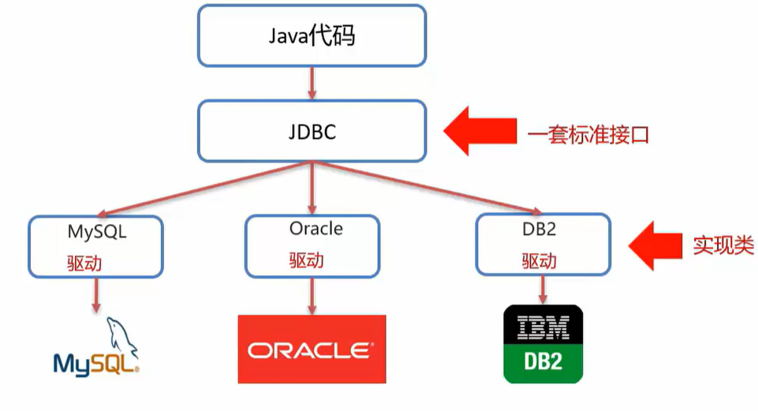
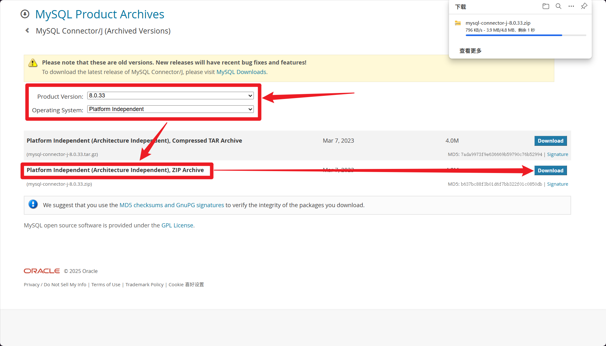
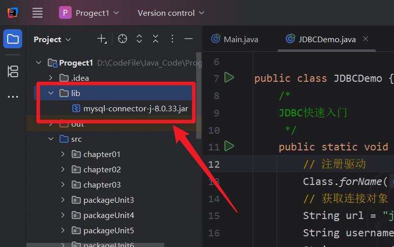
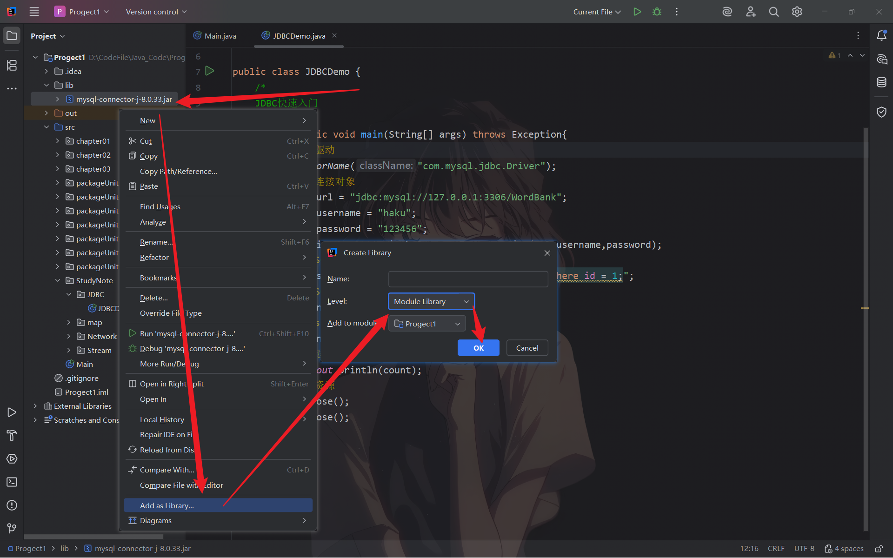
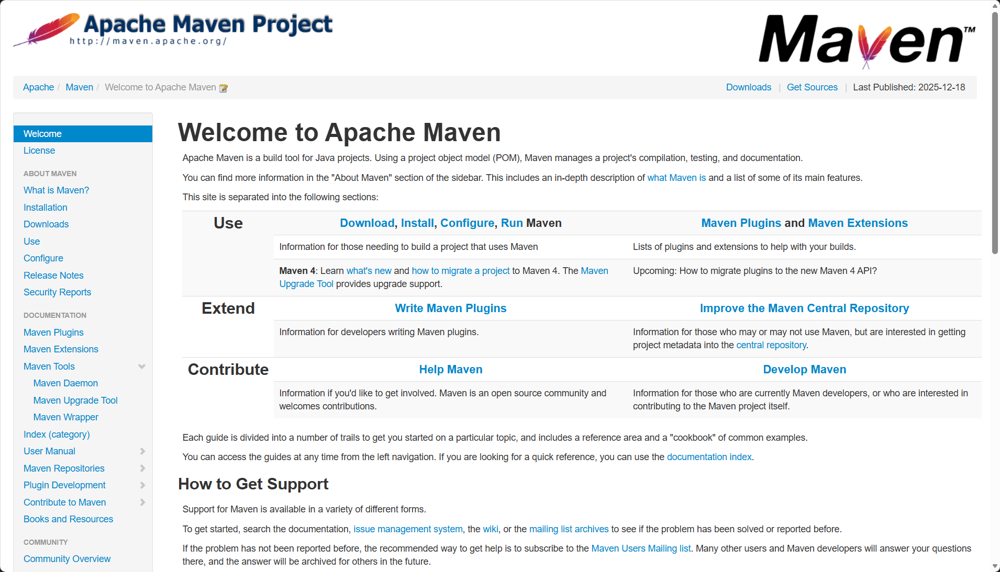
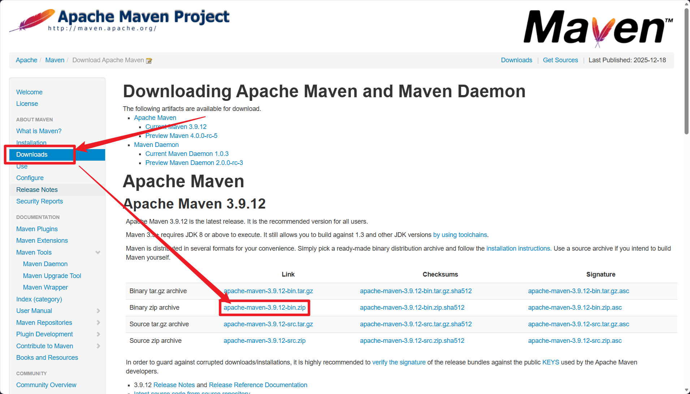

## JDBC简介

**JDBC概念：** JDBC（Java Database Connectivity）是一套访问数据库的标准Java类库，它是使用Java语言操作数据库的一套API。

**JDBC本质：** 
- 官方定义的一套操作所有关系型数据库的规则，即**接口**
- 各个数据库厂商去实现这套接口，提供数据库驱动jar包
- 可以使用这套接口（JDBC）编程，真正执行的代码是驱动jar包中的实现类



**JDBC好处**：各数据厂商使用相同的接口，Java代码不需要针对不同数据库分别开发，可随时替换底层数据库，访问数据库的Java代码基本不变

## JDBC快速入门

#### 步骤

0. 创建工程，导入驱动jar包

```txt
mysql-connector-java-5.1.48.jar // 示例
```

1. 注册驱动

```java
Class.forName("com.mysql.jdbc.Driver")
```

2. 获取连接

```java
Connection conn = DriverManager.getConnection(url,username,password);
```

3. 定义SQL语句

```java
String sql = "insert...";
```

4. 获取执行SQL对象

```java
Statement stmt = conn.createStatement();
```

5. 执行SQL

```java
stmt.executeUpdate(sql);
```

6. 处理返回结果
7. 释放资源

## 补充知识

#### 下载MySQL驱动

若没有给项目配置SQL驱动，则执行上述代码后将会抛出异常，如下：

```error
Exception in thread "main" java.lang.ClassNotFoundException: com.mysql.jdbc.Driver
	at java.base/jdk.internal.loader.BuiltinClassLoader.loadClass(BuiltinClassLoader.java:641)
	at java.base/jdk.internal.loader.ClassLoaders$AppClassLoader.loadClass(ClassLoaders.java:188)
	at java.base/java.lang.ClassLoader.loadClass(ClassLoader.java:526)
	at java.base/java.lang.Class.forName0(Native Method)
	at java.base/java.lang.Class.forName(Class.java:421)
	at java.base/java.lang.Class.forName(Class.java:412)
	at StudyNote.JDBC.JDBCDemo.main(JDBCDemo.java:13)

Process finished with exit code 1
```

我当前的MySQL版本为： 

```txt
mysql Ver 8.0.41 for Win64 on x86_64 (MySQL Community Server - GPL)
```

MySQL下载官网：[MySQL :: MySQL Downloads](https://www.mysql.com/downloads/)

**解决方法一：手动安装SQL驱动**

1. 打开 MySQL 官方驱动下载地址：[https://dev.mysql.com/downloads/connector/j/](https://dev.mysql.com/downloads/connector/j/)

2. 选择 `Select Operating System` 选项至 `Platform Independent`，若找不到对应版本可以去档案库里找（**8.0.x 版本均可兼容 8.0.41**）；


3. 在档案库里面找到兼容的驱动进行下载（下载ZIP压缩包）。



4. 解压后将驱动文件存放至项目的 `lib` 目录下（若无该目录则自行创建）；



5. 右击驱动选择 **"Add as Library"**（IDEA）或 **"Build Path -> Add to Build Path"**（Eclipse），确保驱动被项目识别，然后自定义应用范围，最后点击 `OK`



>[!warning] 提示
>不推荐使用驱动，因为驱动之间存在依赖性问题，所以更加推荐使用Maven

**解决方法二：安装Maven**

1. 访问Maven官网地址：[Welcome to Apache Maven – Maven](https://maven.apache.org/)



2. 点击 `Download` -> 选择对应版本进行下载；



3. 安装完成后解压压缩包到指定目录（路径非中文、无空格）；

4. 配置 `MAVEN_HOME` 系统变量：

```txt
「此电脑」 → 「属性」 → 「高级系统设置」 → 「环境变量」 → 「系统变量」 → 「新建」
变量名： MAVEN_HOME
变量值：解压后的maven文件夹地址，例如 D:\ProgramEnviron\Java\jdbc\apache-maven-3.9.12
```

5. 配置 `Path` 系统变量：

```txt
「系统变量」 → 「PATH」 → 「编辑」 → 「新建」
添加路径：%MAVEN_HOME%\bin
```

6. 验证Maven环境是否配置成功只需打开cmd输入命令 `mvn -v` ，若返回值类似于下面代码块，则标识成功：

```bash
Apache Maven 3.9.6 (bc0240f3c744dd6b6ec2920b3cd08dcc295161ae9) 
Maven home: D:\Develop\apache-maven-3.9.6 
Java version: 17.0.9, vendor: Oracle Corporation, runtime: D:\Java\jdk17 Default locale: zh_CN_#Hans, platform encoding: GBK 
OS name: "windows 10", version: "10.0", arch: "amd64", family: "windows"
```

---
**配置 Maven 本地仓库（可选但强烈推荐）**

>[!info] 提示
>Maven 默认本地仓库在 `C:\Users\你的用户名\.m2\repository`，会占用 C 盘空间，建议修改到其他盘符

1. 进入 Maven 解压目录，找到 `conf` 文件夹下的 `settings.xml` 文件，我的文件地址如下：

```path
D:\ProgramEnviron\Java\jdbc\apache-maven-3.9.12\conf\settings.xml
```

2. 用记事本或编辑器打开 `settings.xml`，找到 `<localRepository>` 标签（默认被注释掉）；

3. 取消注释，修改为自定义仓库路径（需提前创建该文件夹），例如：

```xml
<!-- 本地仓库路径，替换为你的目录 -->
<localRepository>
"D:\ProgramEnviron\Java\jdbc\Maven-repository"
</localRepository>
```

4. （可选）配置阿里云镜像源（加速依赖下载，避免国外源卡顿）在 `settings.xml` 的 `<mirrors>` 标签内添加如下配置：

```xml
<mirror>
	<id>aliyunmaven</id>
	<mirrorOf>central</mirrorOf>
	<url>https://maven.aliyun.com/repository/public</url>
</mirror>
```

5. 保存 `settings.xml` 文件。