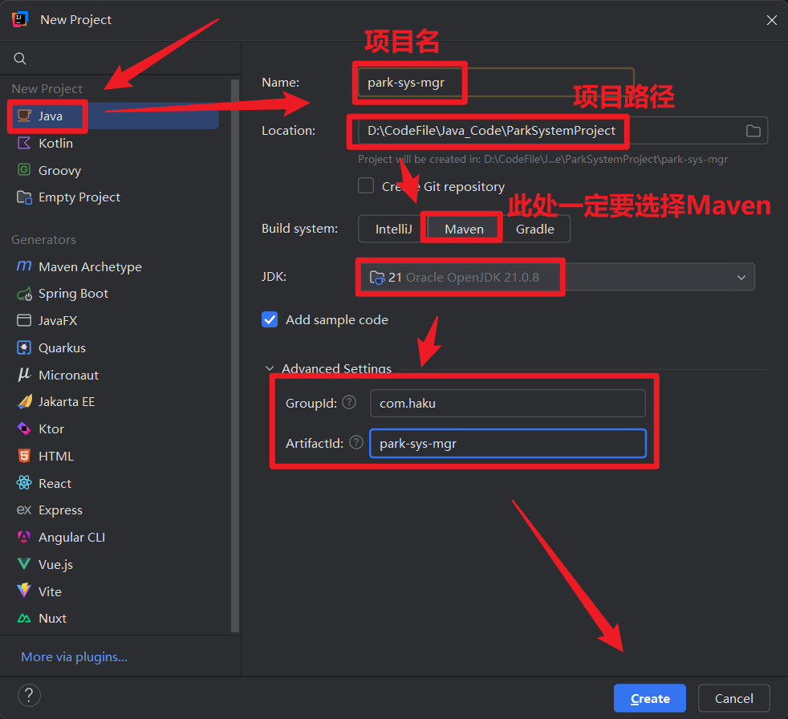
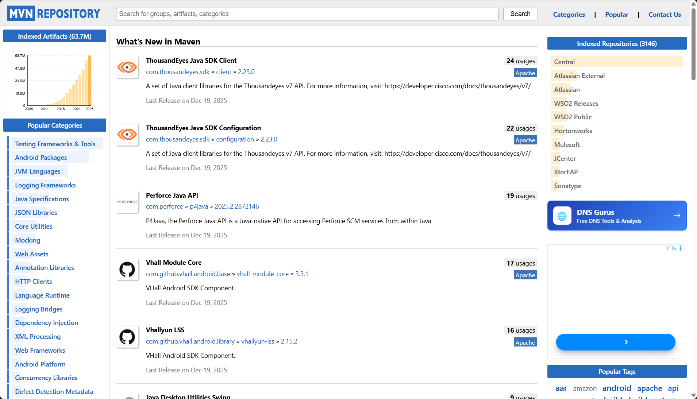
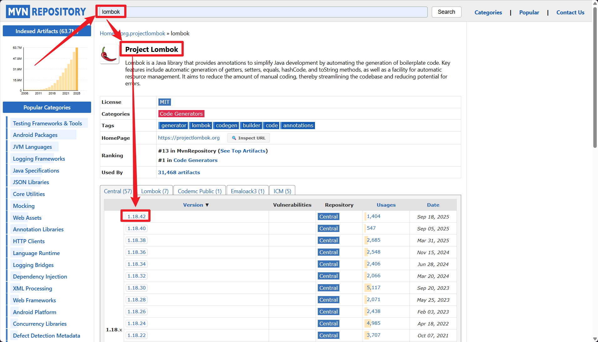
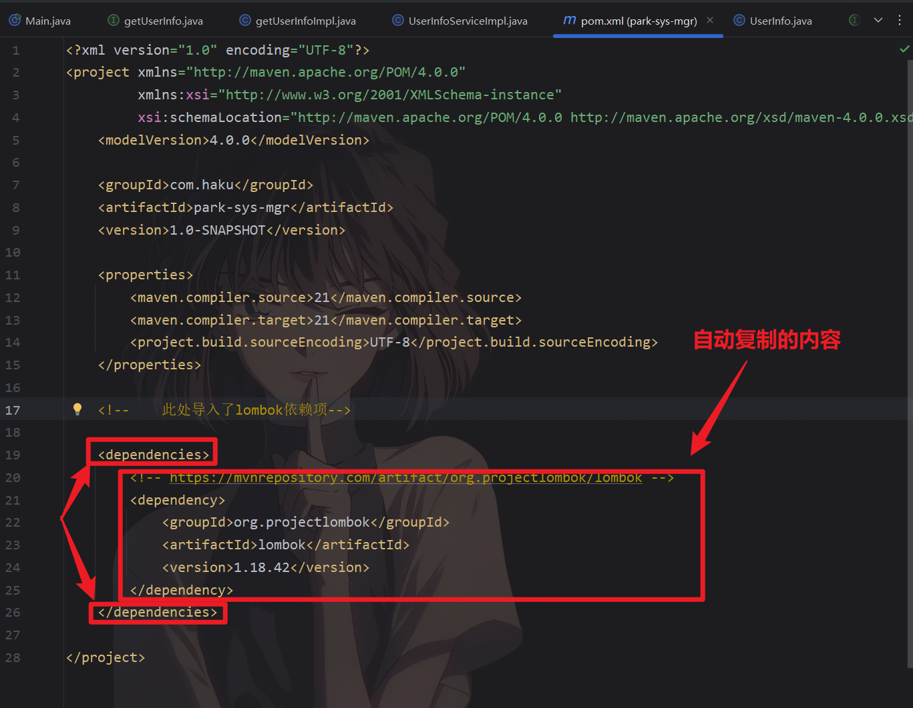
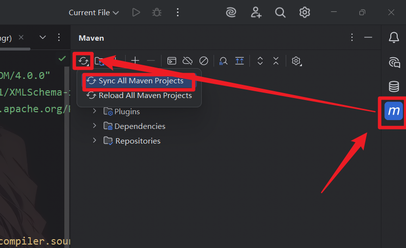

## 项目介绍

基于C/S端实现的停车场管理系统，通过Socket建立连接，在一些硬件设施上进行了简单的模拟实验，并通过MySQL数据库存储。本次面向对象实践项目是完成一个停车管理系统，需要通过Java的集合、IO流、多线程、网络编程、JDBC编程等技术实现用户注册、用户登录、实时监测车位的停车状态、多种停车结算方式、停车车位预约功能、车位的维修日志记录。

>[!tip] 环境准备：
>- **JDK21**
>- **IntelliJ IDEA 2025.2.1**
>- **MySQL Server 8.0.44**
>- **Maven 3.9.12**
>- **lombok 1.18.42**

**Maven Java 项目的基础结构**，各部分功能如下：

```txt
park-sys-mgr（项目根目录）
├── .idea/            # IDEA的项目配置目录（仅IDEA项目有，包含代码风格、运行配置等）
├── .mvn/   # Maven自身的配置目录（通常存放maven-wrapper相关文件，用于统一Maven版本）
├── src/              # 源代码核心目录（Maven约定的源码根目录）
│   ├── main/         # 主程序代码目录
│   │   ├── java/     # Java源代码目录（放.java文件，包名从这里开始）
│   │   └── resources/ # 资源文件目录（放配置文件，如.properties、.xml等，会被打包到classpath）
│   └── test/         # 测试代码目录
│       └── java/     # 测试类源代码目录（放Junit等测试类）
├── target/           # Maven构建输出目录（编译后的class文件、打包后的jar/war包等）
├── .gitignore        # Git版本控制的忽略文件（指定哪些文件/目录不提交到Git）
└── pom.xml           # Maven的核心配置文件（管理依赖、项目信息、构建配置等）
```

>[!info] MVC介绍
>MVC 是**Model-View-Controller（模型 - 视图 - 控制器）**的缩写，是一种经典的软件架构模式，核心是**分离代码的职责**，让项目更易维护、扩展。

## 项目实现

#### 新建Maven项目

1. 打开IDEA，选择 新建项目 选项，然后根据下述方式进行项目创建：



2. 接下来需要下载配置  `lombok` 依赖库。首先打开[Maven Repository: Search/Browse/Explore](https://mvnrepository.com/)来搜索该依赖库；



3. 搜索后找到一个名为  [Project Lombok](https://mvnrepository.com/artifact/org.projectlombok/lombok) 的依赖库点进入，然后选择需要的版本点击进入，这里我使用的是 `Lombok 1.18.42`；



4. 点击对应的版本进入后下拉找到Maven的xml语句块点击；


**这是我刚刚复制的内容原文**

```xml
<!-- https://mvnrepository.com/artifact/org.projectlombok/lombok -->
<dependency>
    <groupId>org.projectlombok</groupId>
    <artifactId>lombok</artifactId>
    <version>1.18.42</version>
</dependency>
```

5. 新建项目后项目中会自动生成一个 `pom.xml` 文件，打开该文件，在 `<project></project>` 标签内新建(若不存在)一个`<dependencies></dependencies>`标签，在该标签内写入复制的lombok的Maven语句块，示例如下：



6. 输入完成后它将像是红色字体，现在只需对其进行刷新即可完成自动下载：点击 Maven -> 点击刷新按钮 -> Sync All Maven Projects；



>[!bug] Error
>若保错，则多尝试几次

>[!question] **为什么要安装lombok依赖库呢？**
Lombok 是 Java 开发中的一个**工具类库**，核心特点是**通过注解自动生成重复代码**，帮开发者减少 “样板代码”（比如 getter/setter、构造函数等），让代码更简洁。用注解替代手动编写的`getter/setter`、`toString()`、`equals()`、构造函数等重复代码。

这是 Lombok 常用注解的对照表，包含核心功能、作用场景，方便快速参考：

|            注解名             | 核心功能                                                      | 适用场景                         |
| :------------------------: | :-------------------------------------------------------- | :--------------------------- |
|          `@Data`           | 自动生成`getter/setter`、`toString`、`equals`、`hashCode`、无参构造函数 | 普通 POJO 类（实体类）               |
|     `@Getter/@Setter`      | 单独生成`getter`/`setter`方法                                   | 只需要部分 get/set 的类             |
|    `@NoArgsConstructor`    | 生成**无参构造函数**                                              | 需要空构造的类（如 Spring Bean）       |
|   `@AllArgsConstructor`    | 生成**全参构造函数**（包含所有字段）                                      | 需要初始化所有字段的场景                 |
| `@RequiredArgsConstructor` | 生成**必填字段的构造函数**（被`final`/`@NonNull`修饰的字段）                 | 强制初始化关键字段                    |
|        `@ToString`         | 生成`toString()`方法（可指定包含 / 排除字段）                            | 需要打印对象信息的类                   |
|    `@EqualsAndHashCode`    | 生成`equals()`和`hashCode()`方法（基于字段）                         | 需要比较对象相等性的类                  |
|          `@Slf4j`          | 自动生成日志对象（`private static final Logger log = ...`）         | 需要打印日志的类（Service/Controller） |
|         `@Builder`         | 生成**建造者模式**代码，支持链式调用创建对象                                  | 复杂对象的构建（避免多参数构造）             |
|      `@SneakyThrows`       | 自动捕获并抛出**受检异常**（无需显式`try-catch`）                          | 简化异常处理（不推荐过度使用）              |
|         `@NonNull`         | 自动对字段 / 方法参数做非空校验，为空则抛`NullPointerException`              | 避免空指针的场景                     |

#### 实现用户的登录接口

