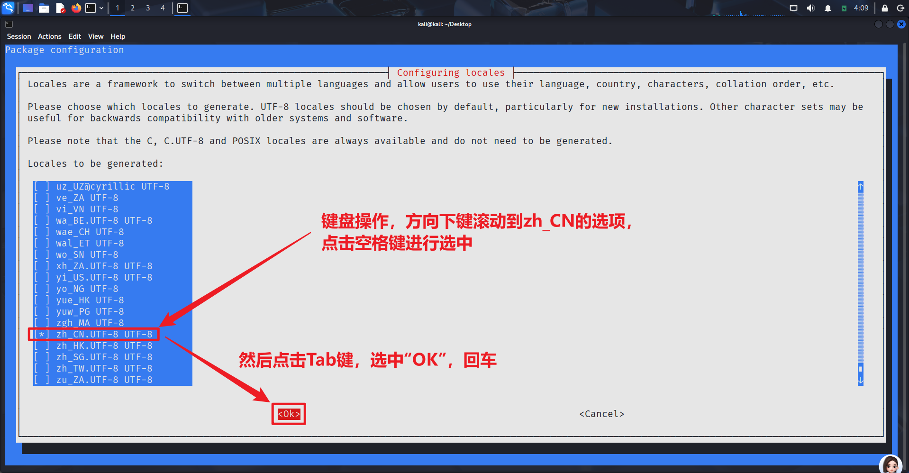
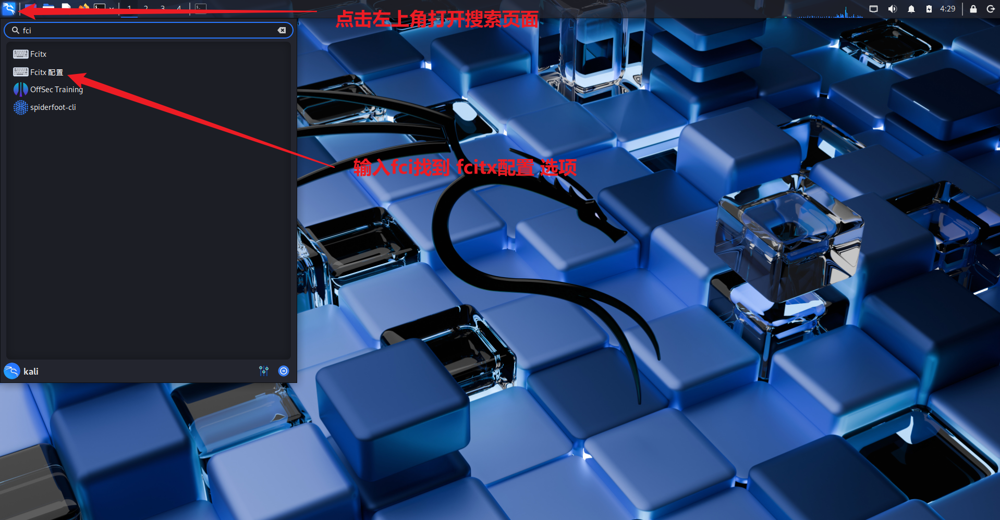

**Kali下载官方地址：[Kali Linux | Penetration Testing and Ethical Hacking Linux Distribution](https://www.kali.org/)**


>[!info]  当前环境
>1. 本次Kali安装包为Kali2025.4版本(当前最新版)
>2. 网络采用家庭电信宽带
>3. 实体机为Windows11家庭版
>4. VMware虚拟机为17版本

## VMware安装

**VMware官网：[VMware by Broadcom - Cloud Computing for the Enterprise](https://www.vmware.com/)**


## Kali下载

1. 进入官网后点击 `Downloads` 进入下载页面，选择虚拟机版本进行下载；


2. 选择安装 `VMware` 版本，点击下载；


3. 等待压缩文件下载完成后对该文件进行解压；


4. 解压完成后在解压后的文件中找到以 `.vmx` 结尾的文件，双击运行它；


5. 成功运行后的页面如下所示。


## Kali配置

>[!warning] Kali安装检查
>安装好kali之后需要做如下的配置和检查、确保自己的网络、设备等可以正常使用！

1. 升级虚拟机、确保虚拟机、确保鼠标和兼容性正常；
- 点击开启此虚拟机
- 将兼容性拉满(选择最顶部的版本)
- 更改此虚拟机


2. 检查网络是否可以正常上网，打开kali自带的火狐浏览器，随意输入一个网站查看是否可以正常访问；


3. 更新源，终端输入 `sudo apt update`；


>[!error] 更新失败情况
>若采用校园网进行更新，则校园网可能会对其进行限制，导致更新失败，所以建议更换为手机热点再进行尝试。新手不建议进行**换源**操作。

4. 成功更新后的页面


## Kali汉化

1. 打开终端输入下列命令打开语言窗口：

```bash
sudo dpkg-reconfigure locales
```

2. 然后通过方向键进行语言选择（这里选择汉语`zh_CN`），指向目标内容后通过`空格键`进行选中，然后`Tab键`选中`ok键`回车；



3. 再次选中目标（这里选择汉语`zh_CN`），然后`Tab键`选中`ok键`回车；


4. 最后对kali进行重启，可以在终端输入下列内容：

```bash
sudo reboot
```

5. 重启后它会弹出文件夹语言更新的询问窗口，在该窗口中勾选 `不要在询问我`，然后选择 `保留旧的名称` 选项，否则后续可能遇到问题。至此，汉化完成！


## Kali中文输入

1. 在终端输入下列命令安装Google的输入法；

```bash
sudo apt install fcitx fcitx-googlepinyin
```


2. 安装成功后终端输入 `sudo reboot` 进行重启；

3. 点击左上角kali图标，打开搜索页面，输入 `fcitx` ，选择 `fcitx配置` 选项；



4. 在输入法配置窗口中选中 `Google拼音` 选项，然后点击下面的向上箭头，让它移动至顶端；


5. 至此，中文输入法配置成功，点击 `Ctrl + 空格` 切换中/英文输入法。