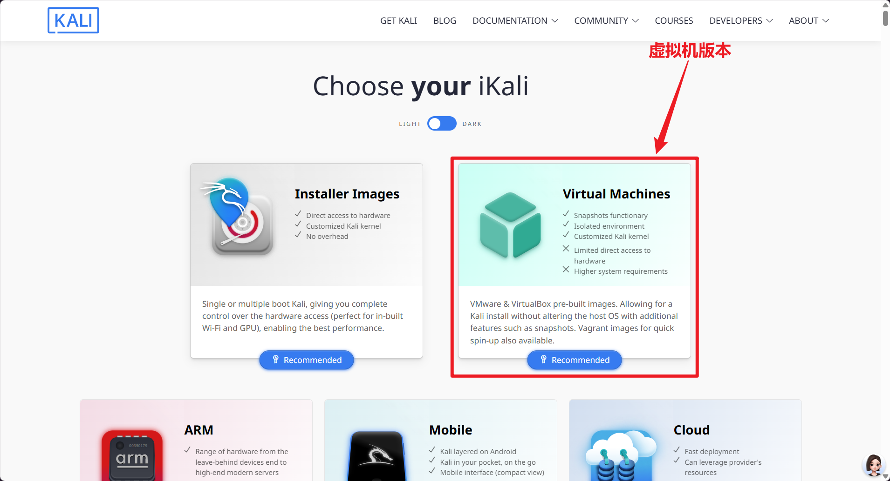
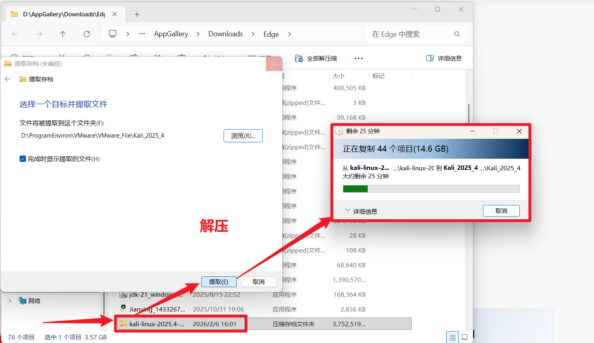
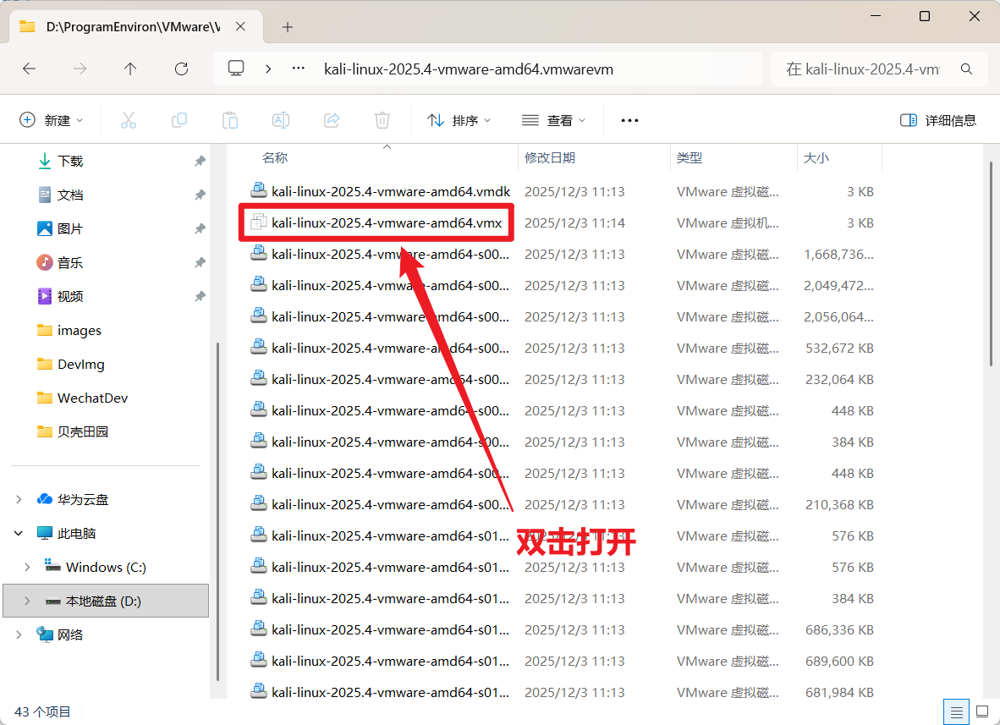

**Kali下载官方地址：[Kali Linux | Penetration Testing and Ethical Hacking Linux Distribution](https://www.kali.org/)**

>[!info]  当前环境
>1. 本次Kali安装包为Kali2025.4版本(当前最新版)
>2. 网络采用家庭电信宽带
>3. 实体机为Windows11家庭版
>4. VMware虚拟机为17版本

## VMware安装

**VMware官网：[VMware by Broadcom - Cloud Computing for the Enterprise](https://www.vmware.com/)**

## Kali下载

1. 进入官网后点击 `Downloads` 进入下载页面，选择虚拟机版本进行下载；

2. 选择安装 `VMware` 版本，点击下载；

3. 等待压缩文件下载完成后对该文件进行解压；

4. 解压完成后在解压后的文件中找到以 `.vmx` 结尾的文件，双击运行它；

5. 成功运行后的页面如下所示。

## Kali配置

>[!warning] Kali安装检查
>安装好kali之后需要做如下的配置和检查、确保自己的网络、设备等可以正常使用！

1. 升级虚拟机、确保虚拟机、确保鼠标和兼容性正常；
- 点击开启此虚拟机
- 将兼容性拉满(选择最顶部的版本)
- 更改此虚拟机

2. 