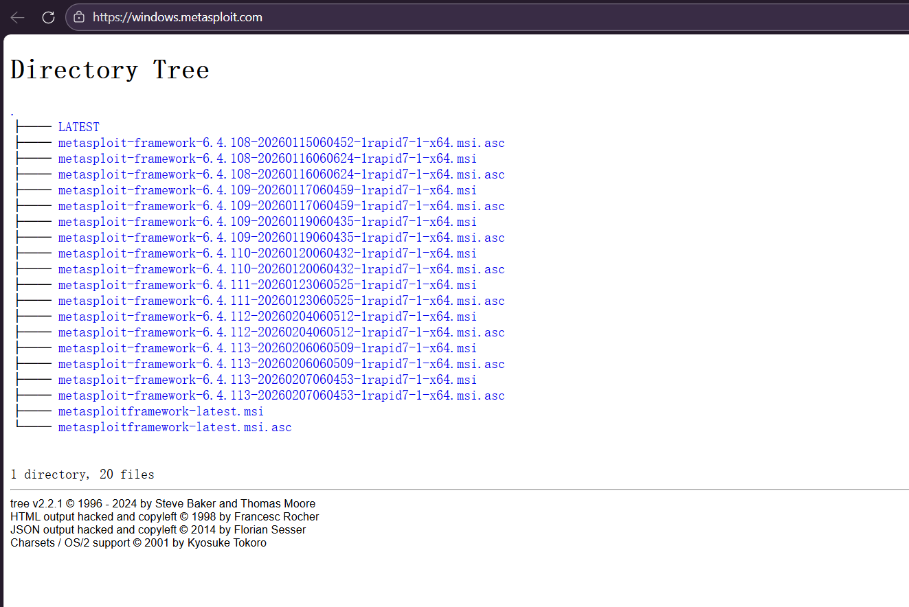

**WannaCry病毒**，使用了**永恒之蓝漏洞**，是一种在2017年5月大规模爆发的勒索病毒，它属于勒索病毒家族，主要通过加密用户计算机中的文件来进行勒索。

>[!BUG] 永恒之蓝
>**永恒之蓝(对应微软漏洞编号 MS17-010)** 是针对Windows的高危远程代码执行漏洞，最初由美国国家安全局开发为攻击工具，2017年4月被黑客组织“影子经纪人”公开后，引发了全球多起重大网络安全事件。

### MSF安装(Windows版)

**Metasploit Framework (MSF)** 是一款开源安全漏洞检测工具，附带数千个已知的软件漏洞，并保持持续更新。Metasploit 可以用来信息收集、漏洞探测、漏洞利用等渗透测试的全流程，被安全社区冠以 “可以黑掉整个宇宙” 之名，支持 Windows、Linux、MACOS，本次课程我们将在 Windows 系统安装 MSF，并且学习相关的工具。

1. 访问官网进行下载，MSF在Kali中自带，MSF官网地址：[Metasploit Framework](https://windows.metasploit.com/)
（点击最新版的 `.msi` 结尾的链接）

2. 先关掉杀软，避免被检测出风险软件，也可以添加路径白名单；然后运行安装程序；

