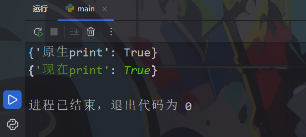
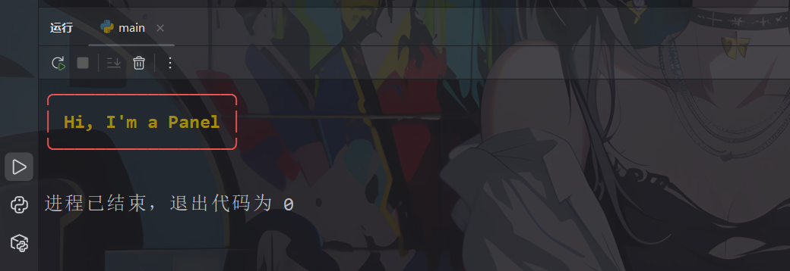
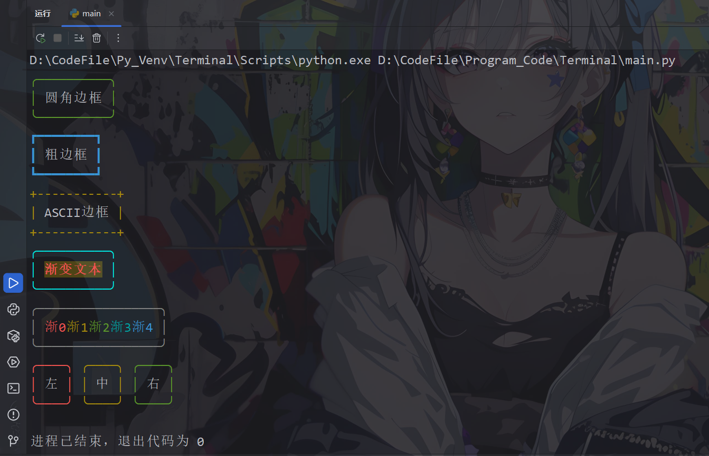
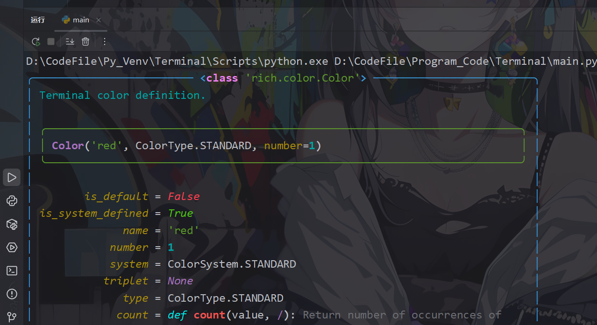
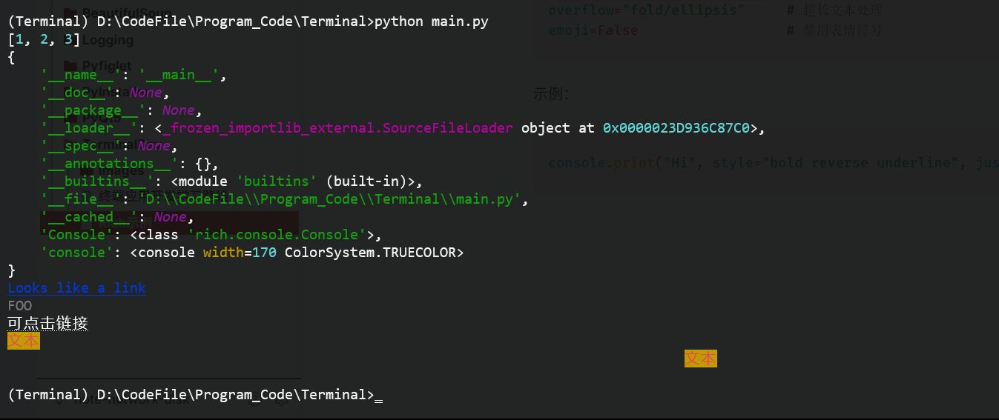

### 简单入门

1. 可以在 REPL 中安装 Rich，这样 Python 数据结构会自动漂亮地打印并标注语法。具体做法如下：

```python
from rich import print as rprint  
print({"原生print":True})  
rprint({"现在print":True})
```



2. 利用 `rich` 库的 `Panel` 组件创建一个带边框的面板，并输出醒目的文本，代码如下：

```python
# 导入rich库的Panel组件和增强版print函数  
from rich.panel import Panel  
from rich import print  
  
# 创建并打印带样式的面板  
# Panel.fit() 会自适应内容宽度，border_style设置边框样式，文本使用加粗黄色  
print(Panel.fit("[bold yellow]Hi, I'm a Panel[/bold yellow]", border_style="red"))
```



3. 设置边框和文字颜色及样式效果：

```python
from rich.panel import Panel  
from rich import print  
from rich import box  
from rich.text import Text  
  
# 1. 基础边框样式（已验证能正常运行）  
print(Panel("圆角边框", border_style="green", expand=False, box=box.ROUNDED))  
print(Panel("粗边框", border_style="blue", expand=False, box=box.HEAVY))  
print(Panel("ASCII边框", border_style="yellow", expand=False, box=box.ASCII))  
  
# 文本+底色（仅文本）  
text = Text("渐变文本", style="bold red on yellow")  
panel = Panel(text, border_style="bright_cyan",expand=False)  
print(panel)  
  
# 模拟文字渐变：每个字符不同颜色  
text = Text()  
colors = ["red", "yellow", "green", "cyan", "blue"]  
for i, color in enumerate(colors):  
    text.append(f"渐{i}", style=color)  
print(Panel(text, border_style="white", expand=False))  
  
# 模拟边框渐变（多个Panel拼接）  
from rich.columns import Columns  
panels = [  
    Panel("左", border_style="red"),  
    Panel("中", border_style="yellow"),  
    Panel("右", border_style="green")  
]  
print(Columns(panels))
```



4. `inspect()` 功能：**详细查看对象的属性和方法**。你的代码效果：

```python
from rich import inspect  
  
# 先创建一个对象，此处以Color对象为例  
from rich.color import Color  
color = Color.parse("red")  
  
# inspect(对象名[, methods=True/False])  
inspect(color, methods=True)
```

- `inspect(color, methods=True)`：显示 Color 对象所有属性和方法
- `methods=True` 表示**同时显示方法**（默认只显示属性）

输出会包含以下内容，清晰列出对象内部结构：

```text
╭─────────────────────────────────────────────────────────────╮
│ <rich.color.Color>                                          │
╰─────────────────────────────────────────────────────────────╯
┌─────────────┬───────────────────────────────────────────────┐
│ attributes  │ color, ...                                    │
│ methods     │ __init__, parse, ...                          │
└─────────────┴───────────────────────────────────────────────┘
```



### Console API

1. 在项目添加一个名为 `console.py` 的文件：

```python
from rich.console import Console
console = Console()
```

2. 然后可以在项目的任何位置导入控制台：

```python
from 项目名.console import console
```

3. 控制台会在渲染时自动检测到一些属性。

- `size` 是终端当前的尺寸（如果你调整窗口大小，尺寸可能会改变）。
- `encoding` 是默认编码（通常为“UTF-8”）。
- `is_terminal` 是一个布尔值，用于指示控制台实例是否正在写入终端。
- `color_system` 是包含控制台颜色系统的字符串（见下文）。

4. 有几个“标准”用于将颜色写入终端，但并非全部都被普遍支持。Rich 会自动检测合适的颜色系统，或者你可以通过给[构造器提供一个值](https://rich.readthedocs.io/en/stable/reference/console.html#rich.console.Console "rich.console.Console")来手动设置。`color_system`你可以设置为以下其中之一：

- `None`完全禁用颜色。
- `"auto"`会自动检测颜色系统。
- `"standard"`可显示8种颜色，包含正常和明亮变化，共16种颜色。
- `"256"`可以显示“标准”中的16种颜色，加上固定的240色调色板。
- `"truecolor"`可以显示1670万种颜色，这很可能就是你显示器能显示的所有颜色。
- `"windows"`在旧版Windows终端中可以显示8种颜色。新的Windows终端可以显示“真彩色”。

>[!warning] 警告
>设置颜色系统时要小心，如果你设置的颜色系统比终端支持的更高，文字可能会无法阅读。

5. `console.print()` 主要参数：

**1. 样式相关**

```python
# 基础
style="bold italic"           # 粗体+斜体
style="underline2"           # 双下划线
style="strike"              # 删除线
style="reverse"             # 反色（前景/背景互换）
style="blink"               # 闪烁

# 颜色
style="red on white"        # 红字白底
style="#ff00ff on #00ff00" # RGB颜色

# 渐变（仅限前景色）
style="gradient(red,blue)"  # 红到蓝渐变
```

**2. 标记语法（Markup）**

```python
"[bold red on yellow]文本[/]"
"[link https://example.com]可点击链接[/]"
```

**3. 其他重要参数**

```python
justify="left/center/right"  # 对齐方式
overflow="fold/ellipsis"     # 超长文本处理
emoji=False                  # 禁用表情符号
```

示例：

```python
console.print([1,2,3])  
console.print(locals())  
console.print("[blue underline]Looks like a link")  
console.print("FOO",style="blink")  
console.print("[link https://example.com]可点击链接[/]")  
console.print("[bold red on yellow]文本[/]")  
console.print("[bold red on yellow]文本[/]",justify="center")
```



6. `console.log()` 关键参数：

```python
# 日志级别（颜色不同）
log("msg", level="info")      # 默认
log("msg", level="warning")   # 黄
log("msg", level="error")     # 红
log("msg", level="success")   # 绿

# 跟踪选项
log_locals=True      # 显示局部变量（你已知）
log_locals=False     # 默认，不显示

# 调用位置
_locals={}           # 手动指定局部变量
_show_locals=False   # 强制隐藏局部变量
_stack_offset=1      # 调整调用栈深度

# 样式控制
style="bold"         # 应用样式
```

示例：

```python

```