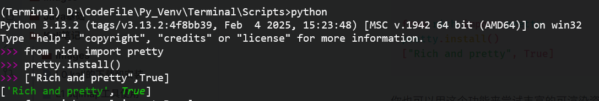
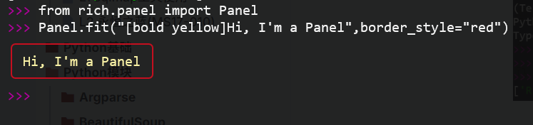

可以在 REPL 中安装 Rich，这样 Python 数据结构会自动漂亮地打印并标注语法。具体做法如下：

```python
from rich import pretty
pretty.install()
["Rich and pretty", True]
```



你也可以用这个功能来尝试丰富的可渲染资源。举个例子：

```python
from rich.panel import Panel
Panel.fit("[bold yellow]Hi, I'm a Panel", border_style="red")
```



