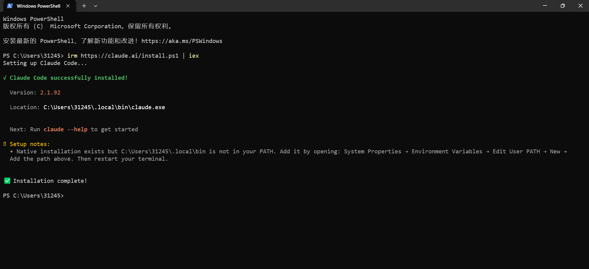
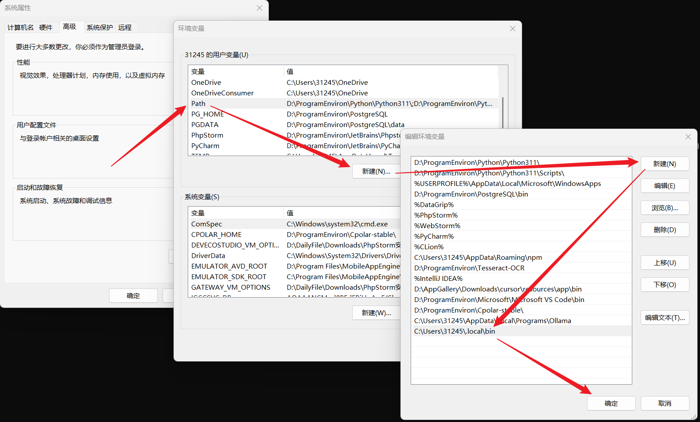
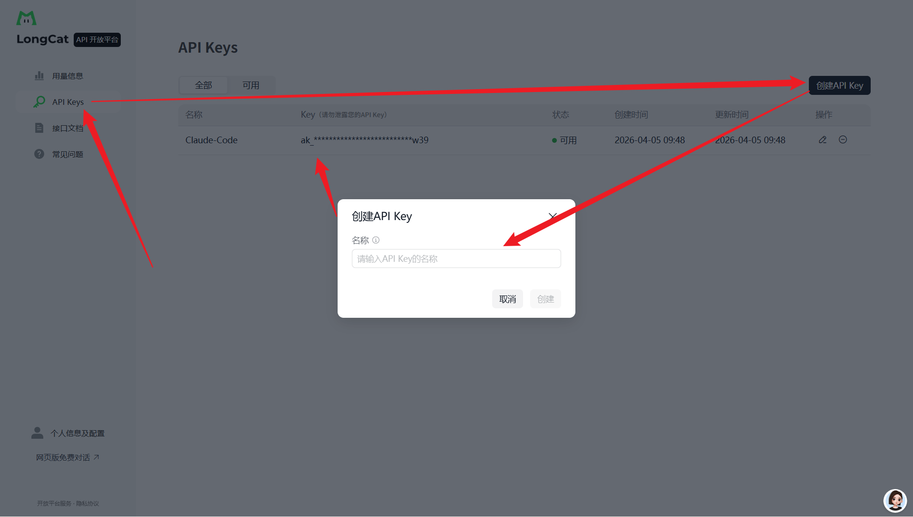
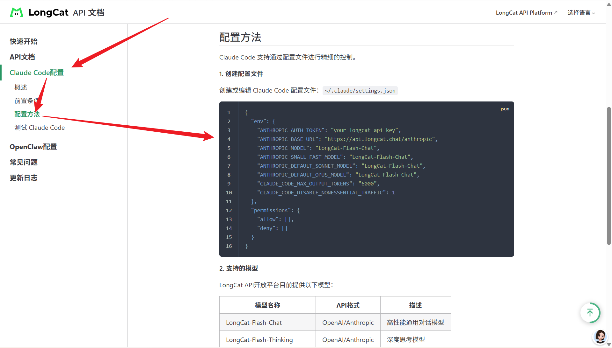

1. 打开 powershell，输入安装指令：

```shell
irm https://claude.ai/install.ps1 | iex
```



2. 此时表示安装成功，但是目前无法直接使用，需要配置环境变量：



3. 重启powershell窗口，执行启动Claudecode命令：

```bash
claude
```

Anthropic对中国大陆地区的服务限制 -> 报错示例：


此处推荐一款免费的大模型 LongCat-Flash-Thinking-2601，因为它免费，适合入门学习，打开LongCat的API开放平台，登录注册后进入该页面；


进入开放平台后就可以看到它每天都赠送 `50w Token` 的额度，每日更新；


接下来创建一个API密钥，点击 APIKeys 创建页面进行创建；



打开 接口文档，找到 Claudecode 的配置文件信息，复制该json文件内容；



