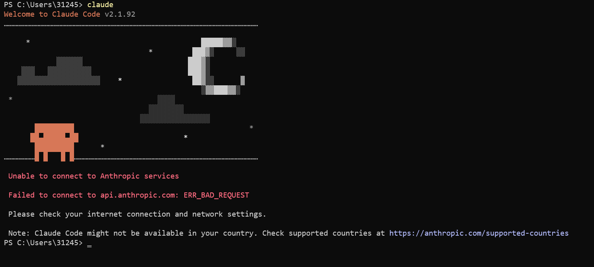
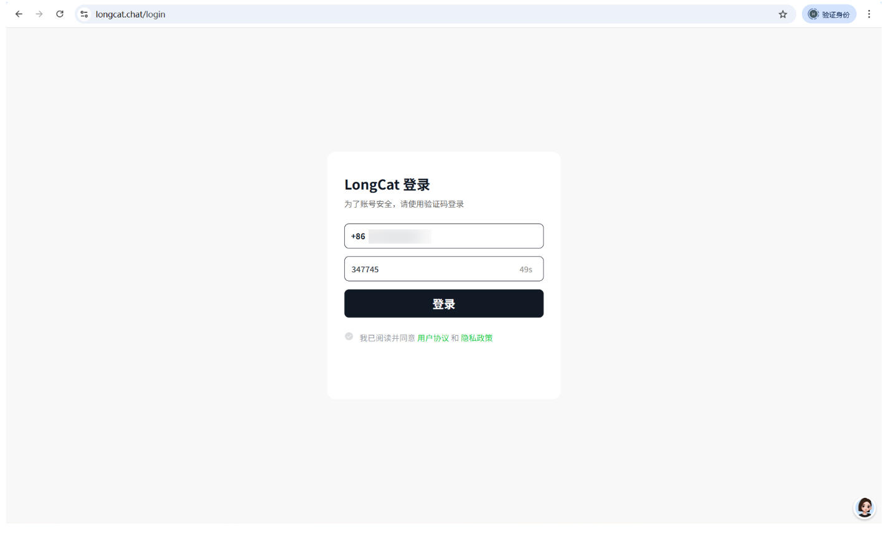
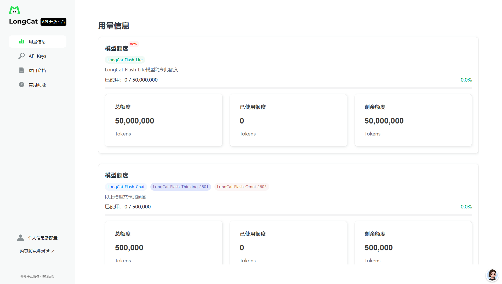
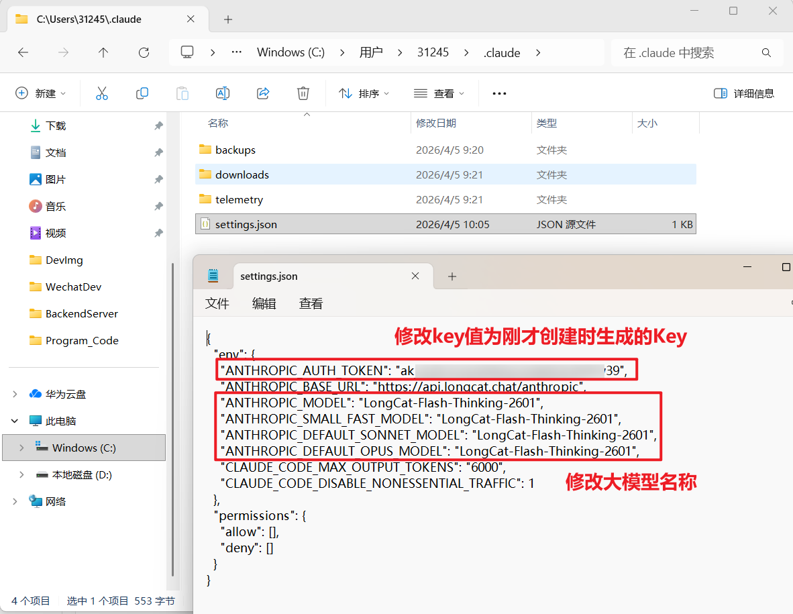
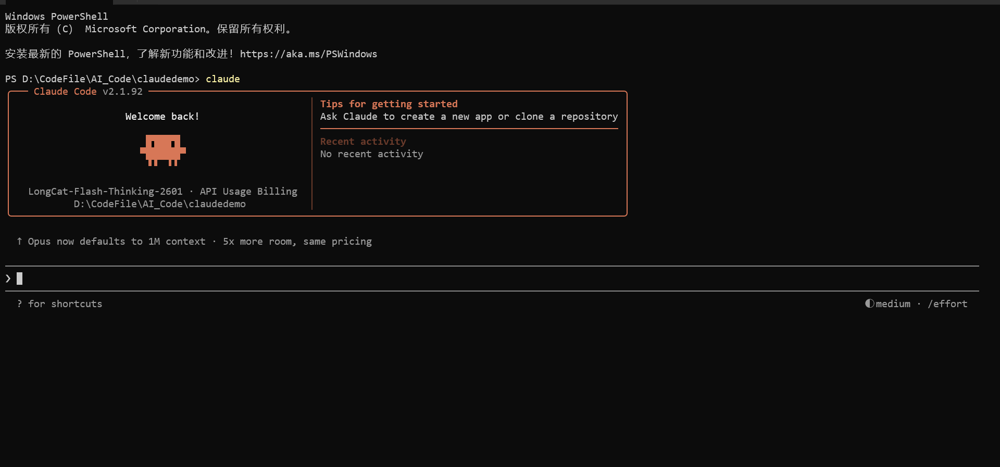
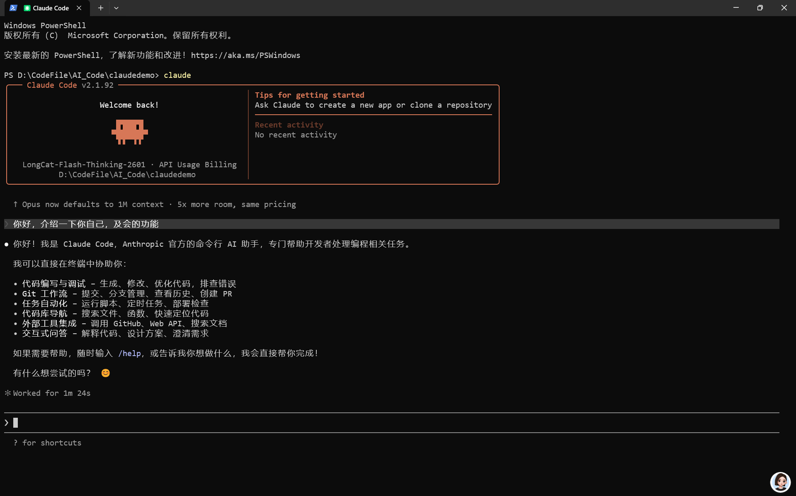
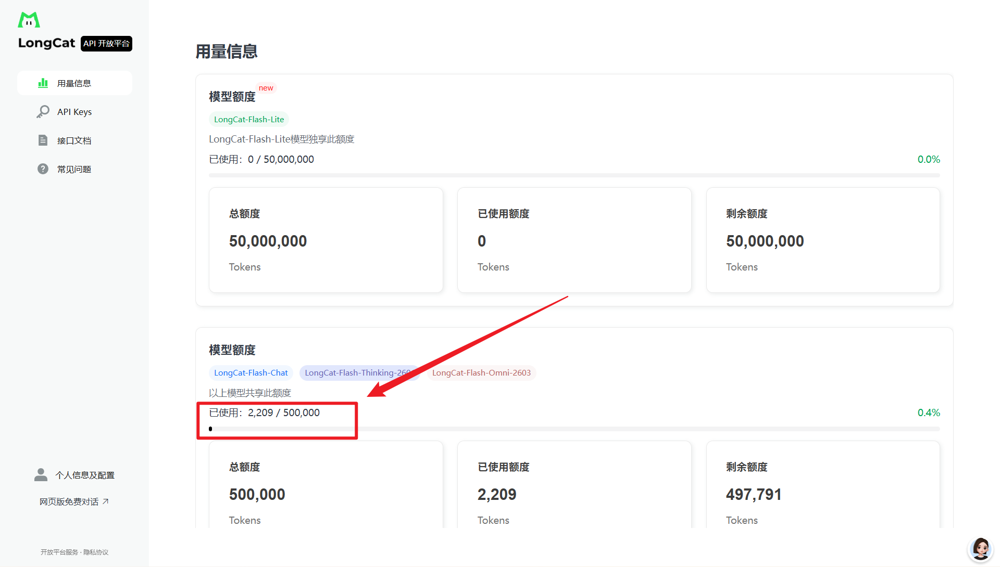

## 安装 ClaudeCode

1. 打开 powershell，输入安装指令：

```shell
irm https://claude.ai/install.ps1 | iex
```


2. 此时表示安装成功，但是目前无法直接使用，需要配置环境变量：


3. 重启powershell窗口，执行启动Claudecode命令：

```bash
claude
```

Anthropic对中国大陆地区的服务限制 -> 报错示例：



4. 此时需要添加指令绕过登录即可，在 `C:\Users\31245` 中找到 `.claude.json` 的配置文件，在文件结尾处新增登录绕过指令：

```json
"hasCompletedOnboarding":true
```


## 配置大模型

1. 此处推荐一款免费的大模型 LongCat-Flash-Thinking-2601，因为它免费，适合入门学习，打开LongCat的API开放平台，登录注册后进入该页面；



2. 进入开放平台后就可以看到它每天都赠送 `50w Token` 的额度，每日更新；



3. 接下来创建一个API密钥，点击 APIKeys 创建页面进行创建；


4. 打开 接口文档，找到 Claudecode 的配置文件信息，复制该json文件内容；


5. 打开 Claudecode 的配置文件 `setting.json` 复制粘贴的内容，文件路径默认为 `C:\User\用户名\.claude`;



6. 接下来找一个信任文件夹，就可以开始使用了





此处所介绍说它时Claudecode模型，但实际为我们刚才配置的大模型Longcat，可以在开放平台看到已经开始消耗Token了。



