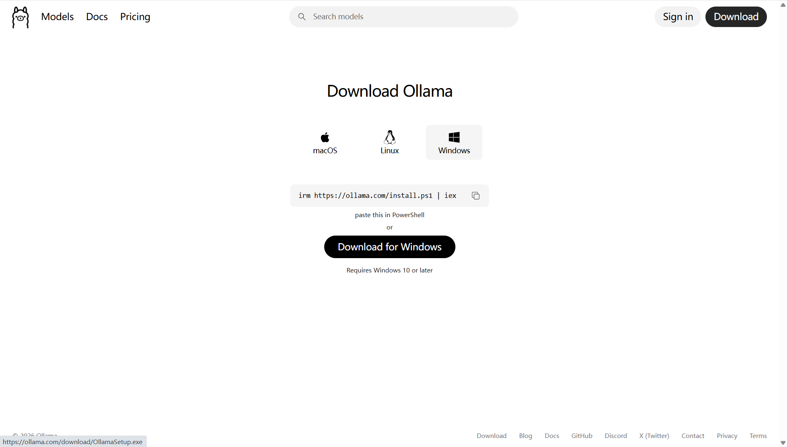
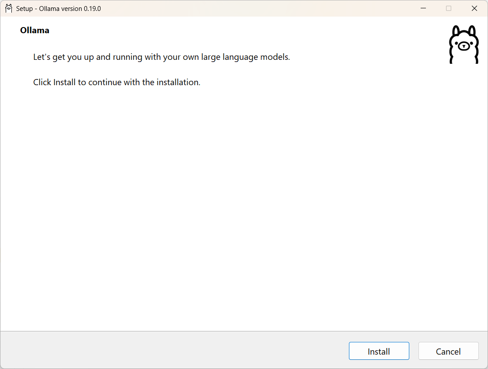
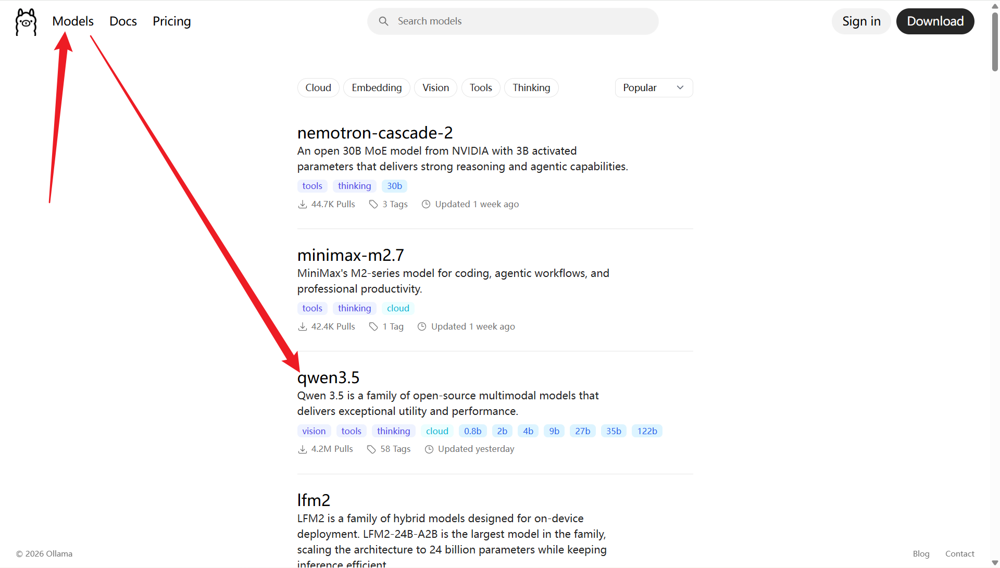
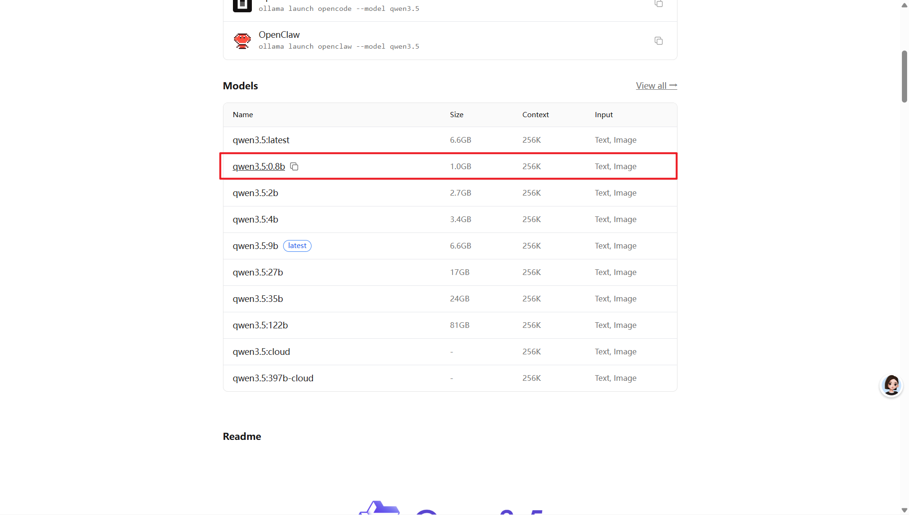
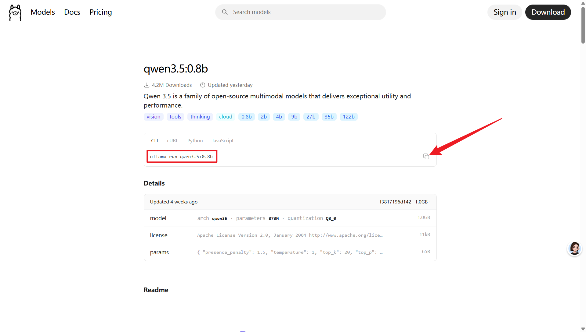
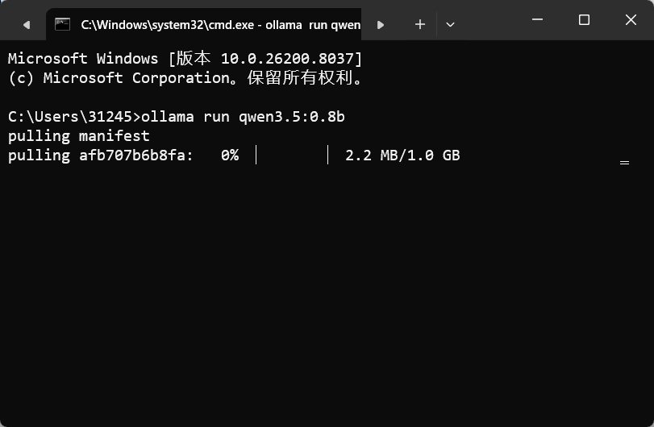

## 安装 Ollama
1. 访问 [Ollama 官方](https://ollama.com/download) 进行安装包下载；



2. 双击安装包后在安装向导中点击 `Install` 进行安装即可



3. 验证是否安装成功，Win + R 输入 `cmd` 打开命令窗口，输入：

```bash
ollama --version
```

若显示ollama的版本信息如 `ollama version is 0.19.0`，则表示安装成功！

## 安装 Models 大模型
1. 点击 Models 进入大模型页面；



2. 根据自己电脑的适配性选择对应的版本，此处以最小的0.8b版本为例



3. 复制对应版本的安装链接在cmd终端页面运行；



4. 首次下载会有一个下载过程，如图所示：



