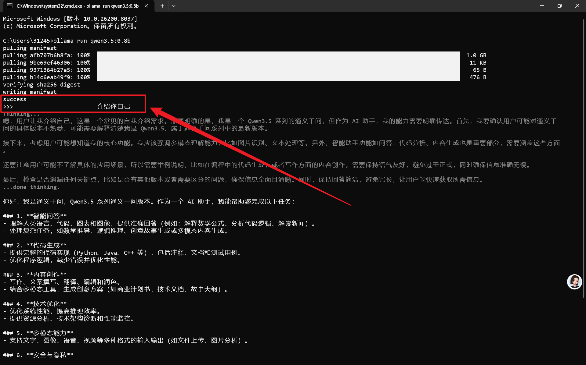
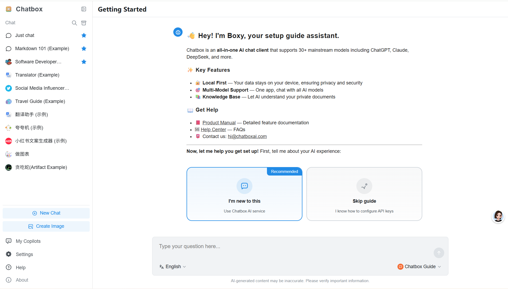
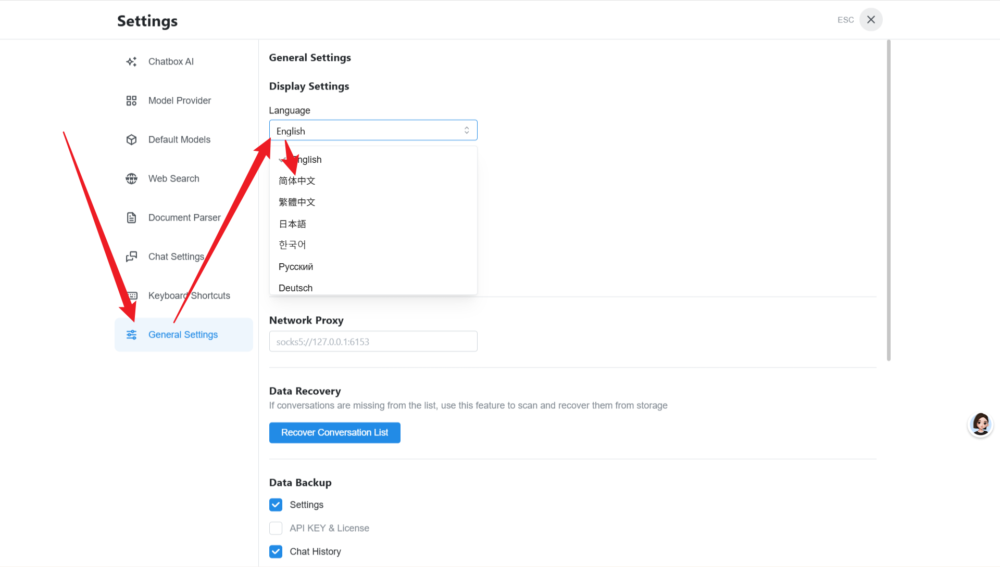
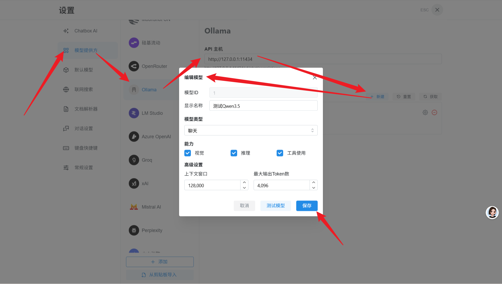
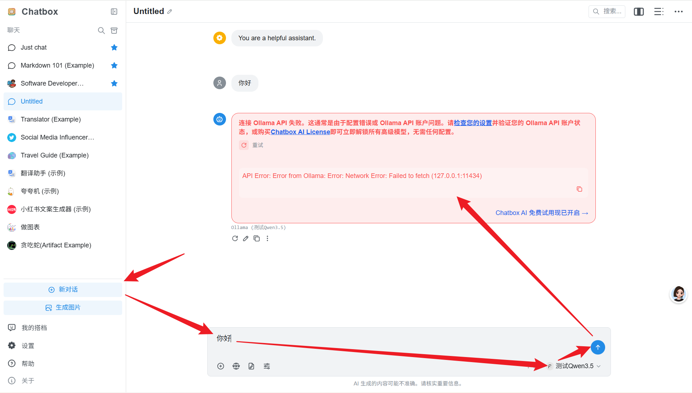
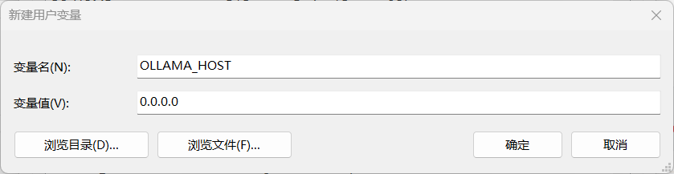
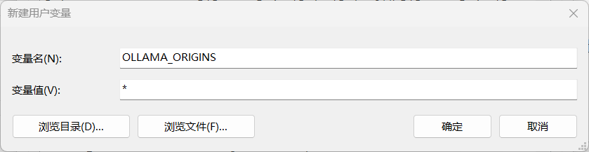
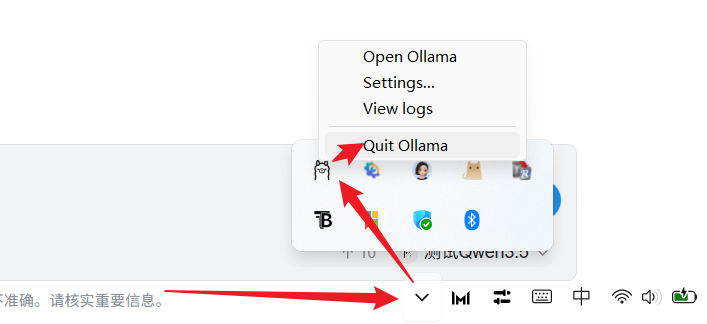
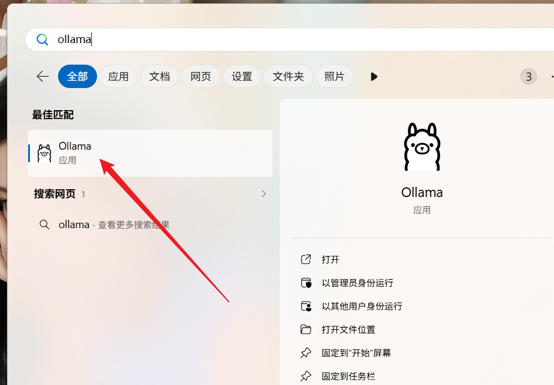

## 安装 Ollama
1. 访问 [Ollama 官方](https://ollama.com/download) 进行安装包下载；


2. 双击安装包后在安装向导中点击 `Install` 进行安装即可


3. 验证是否安装成功，Win + R 输入 `cmd` 打开命令窗口，输入：

```bash
ollama --version
```

若显示ollama的版本信息如 `ollama version is 0.19.0`，则表示安装成功！

## 安装 Qwen3.5 大模型

1. 点击 Models 进入大模型页面；


2. 根据自己电脑的适配性选择对应的版本，此处以最小的0.8b版本为例


3. 复制对应版本的安装链接在cmd终端页面运行；


4. 首次下载会有一个下载过程，如图所示：


5. 安装成功后就可以在终端进行首轮测试了，如下所示：



## 使用 Chatbox AI 进行测试

1. 访问 [Chatbox AI 网页版](https://web.chatboxai.app/) ；



2. 点击左下角 Setting 可以对网页进行汉化设置；



3. 在 Chatbox AI 中创建一个ollama提供的模型；



3. 尝试使用ollama提供的模型进行对话，发现报错了，这是因为未配置环境变量导致的；



4. 配置环境变量，打开环境变量配置窗口，在用户变量中点击新增，输入以下内容：

- 添加该环境配置的目的是让任何IP都能够访问到 ollama；



- 添加该配置的目的是可以接收任何来源的请求



5. 配置环境后一定要重启 ollama 服务，在托盘找到 ollama 并退出，重新搜索应用并打开





