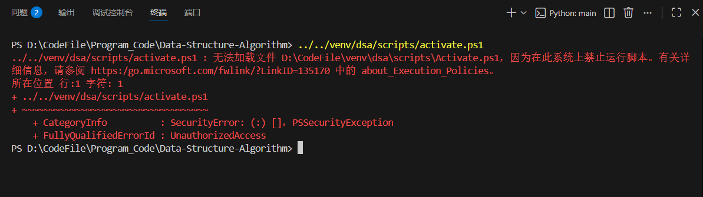
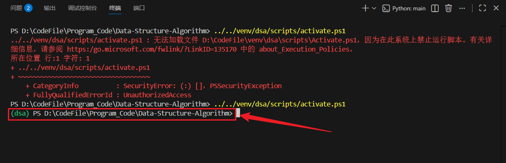

**问题图例：**



#### 步骤 1：以「管理员身份」打开 PowerShell（关键！）

- 点击 Windows 开始菜单，搜索`PowerShell`，右键选择 **「以管理员身份运行」**，不要用 VS Code 里的终端执行这一步。

#### 步骤 2：临时放宽当前用户的执行策略（安全且有效）

在管理员 PowerShell 中输入以下命令，按回车，再输入`Y`确认：

```powershell
Set-ExecutionPolicy RemoteSigned -Scope CurrentUser
```

- 说明：该命令仅允许**当前用户**运行「本地创建的脚本」，不会影响系统全局安全，是官方推荐的开发环境配置。

#### 步骤 3：回到 VS Code 终端，正确激活虚拟环境

此时你的 VS Code 终端进入目标虚拟环境目录，直接执行以下命令：

```powershell
.\Scripts\Activate.ps1
```

- 执行后，终端左侧会出现`(DSA)`标识，说明激活成功！

>[!warning] 注意
>左侧标识DSA取决于你的虚拟环境名称



#### 步骤 4：验证是否真的进入虚拟环境

执行以下命令，查看 Python 路径是否指向虚拟环境的`python.exe`：

```powershell
where python
```

- 正常结果：第一行路径是`D:\CodeFile\venv\DSA\scripts\python.exe`。

---

**额外优化：让 VS Code 打开终端时「自动激活」虚拟环境**，如果不想每次手动激活，按以下设置：

1. 按`Ctrl+Shift+P`，输入`Preferences: Open Settings (JSON)`，打开`settings.json`。
2. 添加以下配置，保存即可：

```json
{
    "python.terminal.activateEnvironment": true,
    "terminal.integrated.defaultProfile.windows": "PowerShell"
}
```

- 之后重启 VS Code 终端，会自动加载当前选中的虚拟环境，无需手动执行激活脚本。

#### 详细解释

#### 1. 先理解指令的核心作用

这句指令的本质是：**给当前 Windows 用户放宽 PowerShell 脚本的执行权限，允许运行你本地创建的脚本（比如虚拟环境的`Activate.ps1`），同时保持对远程脚本的安全校验**，是开发场景下最常用、最安全的权限配置。

#### 2. 逐部分拆解指令含义

|指令部分|具体含义|
|---|---|
|`Set-ExecutionPolicy`|PowerShell 的核心命令，用于**设置脚本执行策略**（控制是否允许运行`.ps1`脚本）|
|`RemoteSigned`|执行策略的「规则类型」（重点）：<br><br>✅ 允许运行**本地创建**的脚本（无签名要求）；<br><br>❌ 运行**从网络下载**的脚本时，必须有可信数字签名（防止恶意脚本）|
|`-Scope CurrentUser`|权限生效的「范围」：<br><br>仅对**当前登录的 Windows 用户**生效，不影响其他用户，也不修改系统全局策略（避免权限过大）|

#### 3. 为什么需要这个指令？

Windows 默认的 PowerShell 执行策略是 `Restricted`（受限模式），会**禁止运行所有.ps1 脚本**—— 这就是你之前执行`Activate.ps1`时提示 “无法加载文件” 的根本原因。

执行 `RemoteSigned -Scope CurrentUser` 后：

- 你本地创建的`Activate.ps1`（虚拟环境激活脚本）、自己写的`.ps1`脚本都能正常运行；
- 从网上下载的脚本（比如不明来源的`.ps1`），如果没有可信签名，依然会被阻止（保证系统安全）；
- 仅对你当前用户生效，不会影响电脑上其他用户的权限（比如家人 / 同事的账号）。

#### 4. 补充说明（新手必看）

##### ① 其他常见执行策略（对比理解）

|策略名称|作用（适用场景）|
|---|---|
|`Restricted`|禁止运行所有脚本（Windows 默认，安全但开发不便）|
|`Unrestricted`|允许运行所有脚本（包括无签名的远程脚本，不推荐）|
|`AllSigned`|所有脚本（本地 + 远程）都需要数字签名（过于严格）|

##### ② 如何验证配置是否生效？

在 PowerShell 中执行以下命令，可查看当前用户的执行策略：

```powershell
Get-ExecutionPolicy -Scope CurrentUser
```

如果返回 `RemoteSigned`，说明配置成功。

##### ③ 如何恢复默认策略（如需）？

如果后续想还原为默认的受限模式，执行：

```powershell
Set-ExecutionPolicy Restricted -Scope CurrentUser
```

#### 总结

1. `Set-ExecutionPolicy RemoteSigned -Scope CurrentUser` 是**开发环境的安全配置**，仅放宽本地脚本的执行权限，不影响系统安全；
2. `-Scope CurrentUser` 是关键，避免修改系统全局权限，降低风险；
3. 这是解决 PowerShell 无法运行本地`.ps1`脚本（如虚拟环境激活脚本）的标准方案，也是 VS Code/Python 开发的常规配置。

简单来说：这个指令就是 “告诉 Windows，我当前用户自己写的脚本可以放心运行，但网上下载的脚本必须有正规签名才允许跑”。