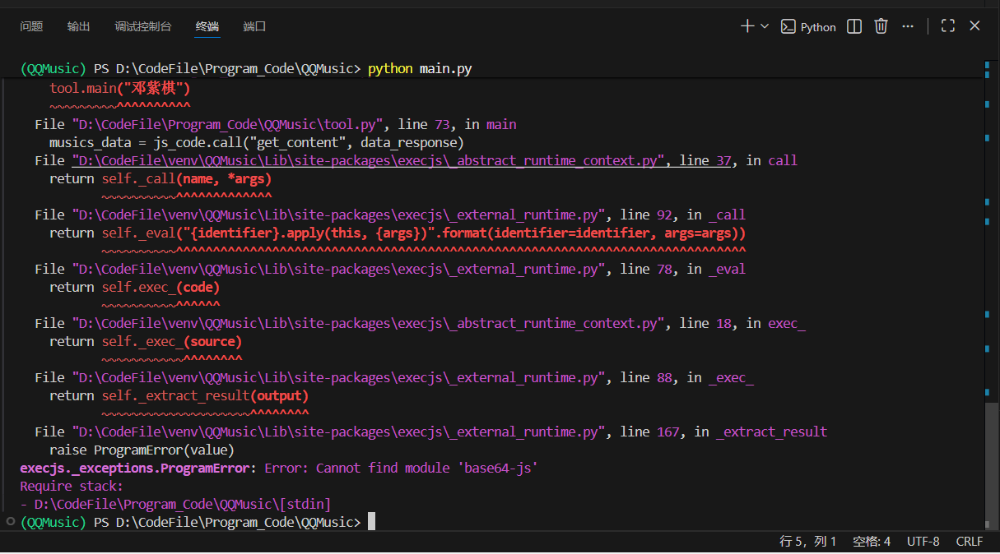
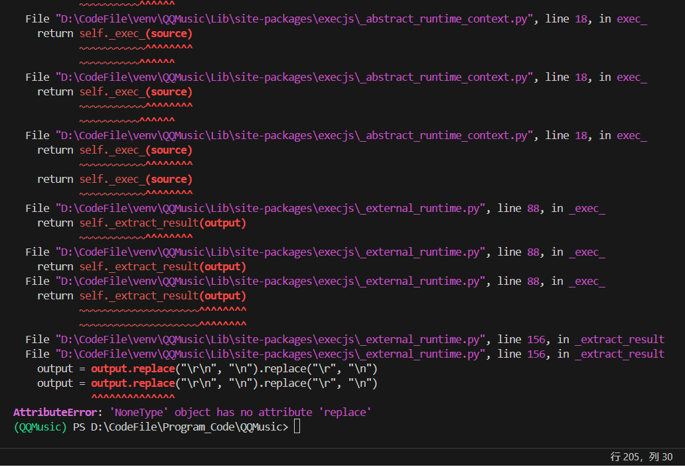

**问题截图**



遇到的核心问题是 **Node.js 包的安装路径与 VSCode 终端的环境不一致**，导致 `base64-js` 包在 VSCode 中无法被找到，本质是不同终端 / 编辑器使用的 Node.js 环境（或包安装路径）不统一。

### 问题原因拆解

1. **全局安装的 “全局” 是相对的**：Node.js 的 `npm install -g` 会把包装到当前终端所关联的 Node.js 版本的全局目录下；
2. **编辑器终端的环境隔离**：PyCharm、VSCode 可能默认使用不同的终端（比如系统 cmd/PowerShell、Git Bash 或 WSL），甚至关联了不同版本的 Node.js（比如你装了多个 Node.js 版本），导致全局安装的包 “跨终端不可见”；
3. **局部安装优先级更高**：相比全局安装，把包装到项目本地（`node_modules` 目录）是更稳定的方式，能避免环境不一致问题。

### 解决方案（优先推荐局部安装，一劳永逸）

#### 步骤 1：在 VSCode 中打开项目终端，定位到项目根目录

确保终端的工作目录是你的 QQ 音乐项目根目录（能看到 `main.py`、`decrypt-data.js` 等文件的目录）。

#### 步骤 2：初始化项目的 `package.json`（首次执行）

```bash
npm init -y
```

这会在项目根目录生成 `package.json`，记录项目依赖，避免后续环境问题。

#### 步骤 3：局部安装 `base64-js` 包

```bash
npm install base64-js --save
```

安装后，项目根目录会生成 `node_modules` 文件夹（存放 `base64-js`），同时 `package.json` 会记录这个依赖。

#### 步骤 4：修改 JS 代码的导入方式（关键）

确保 JS 代码中导入 `base64-js` 的方式适配**局部安装**：

```javascript
// 正确的局部导入方式（推荐）
const base64js = require('base64-js');

// 如果你之前用的是 ES6 导入，也可以：
// import * as base64js from 'base64-js';
```

⚠️ 不要写绝对路径 / 相对路径（比如 `require('./node_modules/base64-js')`），让 Node.js 自动从项目本地的 `node_modules` 查找。

#### 步骤 5：验证安装成功

在 VSCode 终端执行以下命令，测试包是否能被找到：

```bash
node -e "const base64js = require('base64-js'); console.log('安装成功：', base64js)"
```

如果输出 `安装成功：[Object object]`，说明包已正确安装且可访问。

### 备选方案：统一 VSCode 的 Node.js 环境（解决全局安装失效问题）

如果不想局部安装，可确保 VSCode 终端使用的 Node.js 版本和你 “全局安装 base64-js” 的版本一致：

1. 打开 VSCode 的终端，执行 `which node`（Linux/Mac）或 `where node`（Windows），查看当前终端使用的 Node.js 路径；
2. 执行 `npm root -g`，查看该 Node.js 版本的全局包安装目录；
3. 确认 `base64-js` 存在于这个全局目录中（若不存在，在 VSCode 终端执行 `npm install -g base64-js`）；
4. 重启 VSCode，让终端加载最新的环境变量。

### 额外避坑提醒

1. **VSCode 的终端环境继承**：VSCode 默认继承系统终端的环境，但如果装了 nvm（Node.js 版本管理器），需确保 VSCode 终端加载了 nvm 环境（重启 VSCode 或手动执行 `nvm use 你的版本`）；
2. **Python 调用 JS 的路径**：如果你的 Python 代码是通过 `execjs`/`subprocess` 调用 Node.js 执行 JS 文件，需确保调用时的**工作目录是项目根目录**（否则 Node.js 找不到 `node_modules`）；

示例（Python 调用 JS 时指定工作目录）：

```python
import subprocess
import os

# 项目根目录（确保路径正确）
project_root = os.path.dirname(os.path.abspath(__file__))
# 调用 Node.js 执行 JS 文件，cwd 指定工作目录
result = subprocess.run(
	["node", "decrypt-data.js"],
	cwd=project_root,  # 关键：指定项目根目录
	capture_output=True,
	encoding="utf-8"
)
```

1. **忽略无关文件**：在项目根目录创建 `.gitignore`，添加 `node_modules/`，避免提交依赖文件夹到代码仓库。

### 总结

1. **核心解决方案**：用 `npm init -y` + `npm install base64-js` 做项目局部安装，适配所有编辑器 / 终端；
2. **关键要点**：JS 导入方式用默认的 `require('base64-js')`，Python 调用 JS 时确保工作目录是项目根；
3. **避坑核心**：局部安装依赖比全局安装更稳定，能彻底解决不同编辑器 / 终端的环境不一致问题。

按这个步骤操作后，VSCode 中就不会再报 `Cannot find module 'base64-js'` 的错误了。

**问题截图**


