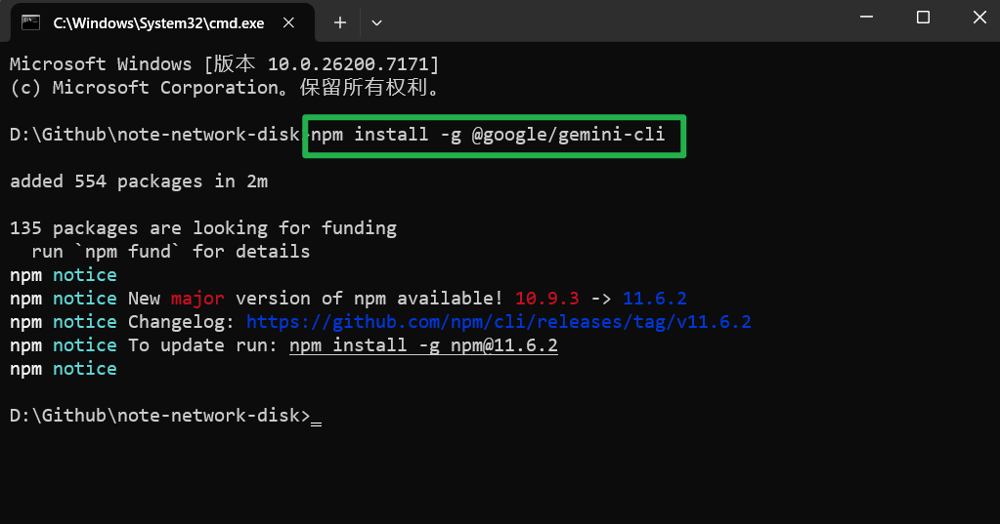

### 工具介绍

- **Obsidian**      高效读写文件，支持Markdown语法
- **Github**         强大且免费的代码托管平台
- **Gemini CLI**  完全免费的AI工具

---

### Obsidian附件格式处理

在使用Obsidian时会发现，附件是以Obsidian特有的 `Wiki` 格式出现的，因此若要让笔记文件在各个设备及平台间实现随时查阅，必须修改其附件格式，此处我使用的工具是 `custom-attachment-location`，该工具可以自定义附件的URL格式和文件存储位置。

1）打开Obsidian设置，找到 `文件与链接` 选项，关闭 `使用Wiki链接` 开关；


2）继续找到 `第三方插件` 选项，点击 `关闭安全模式` 按钮，点击社区插件市场的 `浏览` 按钮；


3）在搜索栏中搜索插件 `Custom Attachment Localtion`，点击插件进入后进行 `安装` 和 `启动`；


4）然后点击 `选项` 进入配置页面，修改 `Markdown URL 格式` 选项内容如下所示，`附件重命名模式` 选项为 `全部`，开启 `是否重命名附件文件` 选项，配置样式如图所示：

```markdown
assets/${noteFileName}/${generatedAttachmentFileName}
```


5）再次回到 `文件与链接` 选项，将 `内部链接类型` 修改为 `基于当前笔记的相对路径` 即可。


6）现在当存在附件时，它将自动以设置的格式进行配置，如下图：


### Obsidian与Gemini CLI联用

1）在安装Gemini CLI之前确保已安装Node.js，下面分别为两个网站的官方网址；

[Node.js — 在任何地方运行 JavaScript](https://nodejs.org/zh-cn)   |   [Build, debug & deploy with AI | Gemini CLI](https://geminicli.com/)


2）复制Gemini CLI官网的安装指令，指令如下：

```bash
npm install -g @google/gemini-cli
```

3）在Obsidian的笔记文件夹中打开终端，粘贴安装指令回车等待安装；



4）安装成功后输入 `gemini` 启动Gemini CLI，选择 `Login with Google` 登录海外环境；


5）在登录验证身份后就可以使用Gemini CLI这款AI工具了，它可以直接在当前文件夹中操作文件。

>Enhancing Export 导出插件
>与下载`Custom Attachment Localtion` 的方式类似，安装启动后即可使用！

