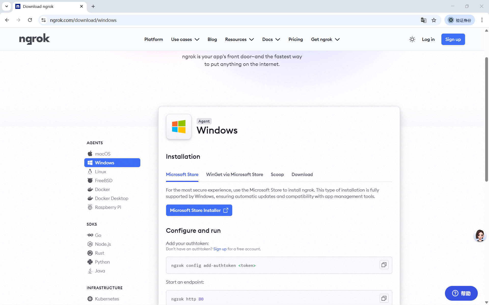

### 适配 Flask + 小程序的实操步骤（最简版，直接用）

以**Ngrok**（最易用，新手首选）为例，全程 5 分钟搞定：

#### 步骤 1：本地跑通 Flask API

确保你的 Flask 项目能正常运行，关闭`debug=False`，绑定所有 IP（`host='0.0.0.0'`），比如核心代码：

```python
from flask import Flask, jsonify
from flask_cors import CORS
app = Flask(__name__)
CORS(app, supports_credentials=True) # 必开跨域

@app.route('/api/hello', methods=['GET'])
def hello():
    return jsonify({"code":200, "msg":"小程序调用本地接口成功"})

if __name__ == '__main__':
    app.run(host='0.0.0.0', port=5000, debug=False) # 关键：0.0.0.0
```

运行后，浏览器输`localhost:5000/api/hello`能返回数据，说明本地接口正常。

#### 步骤 2：下载并启动 Ngrok（免安装、免注册）

1. 官网下载对应系统的 Ngrok（[https://ngrok.com/](https://ngrok.com/)），解压后得到一个可执行文件（如 ngrok.exe）；


2. 打开电脑的**命令行 / 终端**，进入 Ngrok 所在文件夹，输入命令：

```shell
ngrok http 5000 # 5000是你Flask绑定的端口，必须一致
```

3. 回车后，Ngrok 会自动启动，生成**HTTPS 公网域名**（看终端里的`Forwarding`行，比如`https://1234-abcd-efgh.ngrok.io -> http://localhost:5000`）。

#### 步骤 3：小程序调用这个穿透域名

把小程序里的请求地址，从`localhost:5000`换成 Ngrok 生成的 HTTPS 域名，比如：

```js
// 小程序请求代码
wx.request({
  url: 'https://1234-abcd-efgh.ngrok.io/api/hello', // 穿透的HTTPS域名
  method: 'GET',
  success: (res) => {
    console.log(res.data) // 能拿到本地Flask的返回结果，说明成功
  }
})
```

#### 步骤 4：小程序开发者工具临时配置（必做）

因为穿透域名是临时的，还没添加到小程序后台的「合法域名」，需要关闭校验：

开发者工具 → 右上角「详情」→ 本地设置 → 勾选**不校验合法域名、web-view（业务域名）、TLS 版本以及 HTTPS 证书**。

### 关键注意点（避坑必备）

1. **穿透域名是临时的**：Ngrok 免费版每次重启，域名都会变，重新复制替换到小程序即可；
2. **电脑不能关机 / 断网**：你的电脑是本地服务器，一关就没了，测试时保持开机、连网；
3. **免费版有小限制**：Ngrok 免费版有流量 / 连接数限制，仅适合测试，不适合上线；
4. **端口必须一致**：Flask 的`port`和 Ngrok 命令里的端口必须相同（比如都是 5000），否则转发失败；
5. **跨域必须开**：Flask 里的`CORS(app)`一定要加，否则小程序会报跨域错误。

### 替代工具（Ngrok 不好用的话换这些）

都是免费版可用，适配 Flask + 小程序：

- **FRP**：比 Ngrok 更稳定，需自己搭服务端（也有免费公共节点），适合长期测试；
- **花生壳**：国内穿透工具，免费版有固定二级域名，不用每次换地址；
- **Localtunnel**：免注册，终端一行命令启动，`npx localtunnel --port 5000`。

这种方式是小程序测试阶段的「最优解」，零成本、快上手，不用折腾云服务器的环境和备案，等你测试完成后，再把 Flask 部署到云服务器即可。

## Ngrok配置（必选）

### 1. 第一步：注册并获取 Auth Token

- 去 Ngrok 官网（[https://ngrok.com/](https://ngrok.com/)）注册一个免费账号。
- 登录后在 **Dashboard** 页面找到你的 `Auth Token`（认证令牌）。
- 这个 Token 是用来让 Ngrok 识别你的身份，完成穿透服务的关键。

### 2. 第二步：在本地配置 Auth Token

在命令行里进入 Ngrok 所在的文件夹，执行以下命令：

```bash
ngrok config add-authtoken <你的Auth Token>
```

比如你的 Token 是 `123456789abcdef`，就输入：

```bash
ngrok config add-authtoken 123456789abcdef
```

执行后，Ngrok 会把 Token 保存到本地配置文件里，以后启动就不用每次都输了。

### 3. 第三步：启动 Ngrok 进行内网穿透

配置好 Token 后，再启动你的穿透命令，比如：

```bash
ngrok http 5000
```

这时候如果配置正确，命令行就会显示：

- `Session Status` 变成 `online`
- 出现 `Forwarding` 行，显示公网域名（如 `https://xxxx-xxxx-xxxx.ngrok.io -> http://localhost:5000`）
- 你就可以用这个 HTTPS 公网域名来访问本地的 Flask 服务了