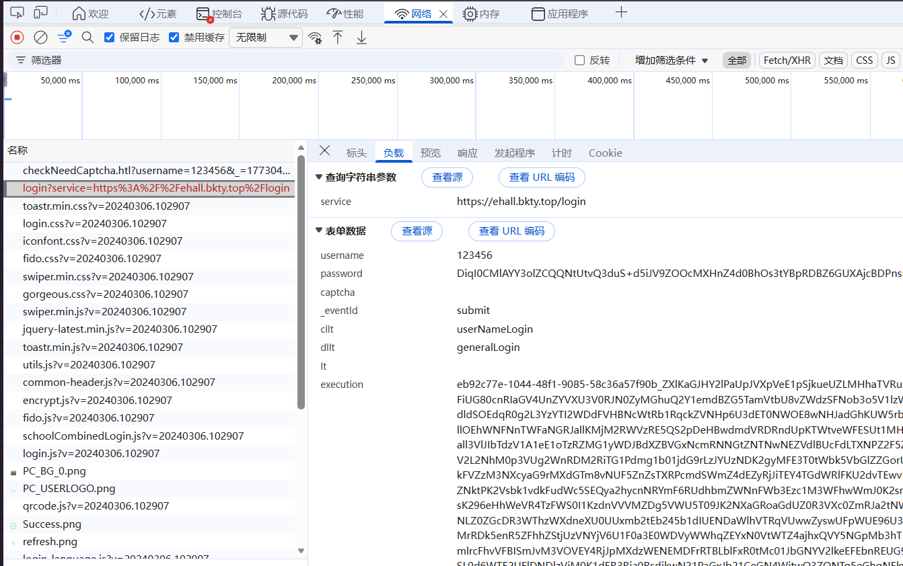

## 首要分析

教务系统原始登录URL: http://jw.bkty.top:89/jsxsd/xk/LoginToXk
登录时携带参数 `service=http%3A%2F%2Fjw.bkty.top%3A89%2Fjsxsd%2Fsso.jsp`

更新后的登录URL: https://authserver.bkty.top/authserver/login
登录时携带参数 `service=https%3A%2F%2Fehall.bkty.top%2Flogin`

## 初步判断

经过多轮登录测试抓包分析后，我发现系统对POST请求时的参数进行了调整，看似对 `password` 和 `execution` 参数进行了加密处理。之前的登录只包含 `password`，对其进行Base64编码然后将 `password` 和 `username` 拼接即可，而现在明显变复杂了。



## 解决password加密

### 分析加密逻辑

经过断点调试分析后，我找到了 `password` 的加密逻辑，如下：

```js
function getAesString(n, f, c) {
    f = f.replace(/(^\s+)|(\s+$)/g, "");
    f = CryptoJS.enc.Utf8.parse(f);
    c = CryptoJS.enc.Utf8.parse(c);
    return CryptoJS.AES.encrypt(n, f, {
        iv: c,
        mode: CryptoJS.mode.CBC,
        padding: CryptoJS.pad.Pkcs7
    }).toString()
}
function encryptAES(n, f) {
    return f ? getAesString(randomString(64) + n, f, randomString(16)) : n
}
function encryptPassword(n, f) {
    try {
        return encryptAES(n, f)
    } catch (c) {}
    return n
}
```

这个加密流程可以完整拆解为以下步骤：

1.核心函数与参数

- **`encryptPassword(n, f)`**：入口函数，明文 `n = "password"`，密钥 `f = "qzYOhusq5pdG0HpZ"`。
- **`encryptAES(n, f)`**：根据密钥 `f` 是否存在，决定是否调用 `getAesString`。
- **`getAesString(n, f, c)`**：真正的 AES 加密实现。

2.加密流程拆解

步骤 1：密钥与 IV 处理

```javascript
// 去除密钥首尾空白
f = f.replace(/(^\s*)|(\s*$)/g, "");
// 将密钥和IV从UTF-8字符串转为CryptoJS WordArray
f = CryptoJS.enc.Utf8.parse(f);
c = CryptoJS.enc.Utf8.parse(c);
```

- **密钥 (Key)**：`f = "qzYOhusq5pdG0HpZ"`，经 UTF-8 解析后作为 AES 密钥。
- **IV 向量**：`c` 由 `encryptAES` 传入，是一个 16 字节的随机字符串（`randomString(16)`）。

步骤 2：明文预处理

```javascript
// 当密钥f存在时，明文n会被包装
n = randomString(64) + n + randomString(16)
```

- 明文会被前后拼接随机字符串，增加破解难度。

步骤 3：AES 加密

```javascript
return CryptoJS.AES.encrypt(n, f, {
    iv: c,
    mode: CryptoJS.mode.CBC,
    padding: CryptoJS.pad.Pkcs7
}).toString()
```

- **算法**：AES
- **模式**：CBC（需要 IV 向量）
- **填充**：PKCS7
- **输出**：Base64 编码的字符串（`.toString()` 默认输出 Base64）

---

3.与你之前例子的对应关系

- **源数据**：`zhangsan123`
- **加密后数据**：`5DRD+admenZl9WWjS8p7uW68Mt35cc4nOFLx0cvBTQWW0uwVddzBr//yBYdkAWGHY+SyzITpKdRKettRtPfZyFcx/0HF/8x1Rpfcqxcgxn0=`
- **结论**：这个 Base64 字符串正是上述 AES-CBC-PKCS7 加密后，再经 Base64 编码的结果。

### 实现加密逻辑

```python

```