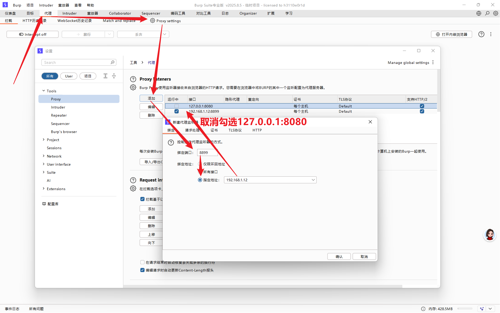
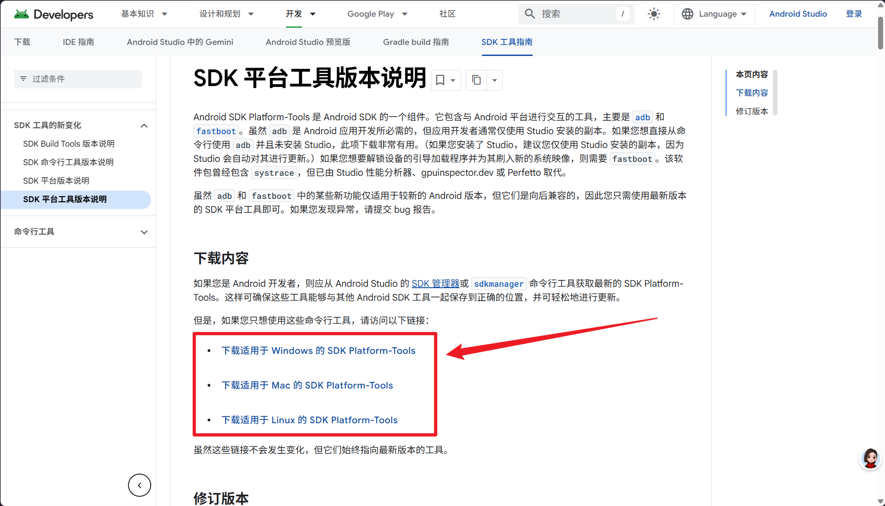
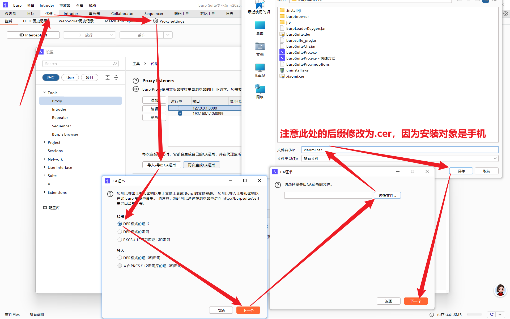

## 设置代理

1.启动Burp，进入代理的设置页面，然后设置监听器为 `192.168.1.12`（此处是我本机电脑IP，端口自定义）



2.设置电脑和手机的网络处于同一网段内，如我的电脑和手机连接的同一个WIFI，所以此时手机的IP为 `192.168.1.10` ，接下来进入手机端的WIFI设置页面，给手机设置代理，步骤如下：
- 设置 -> WLAN -> 与电脑相同的WIFI名（进入当前WiFi的详情页面）
- 修改代理：无 -> 手动
- 设置代理参数：主机名->电脑IP（如 `192.168.1.12`）；端口->监听器端口（如 `8899`）
- 保存

## 使用ADB连接手机

### ADB下载安装

**官方精简版**：[platform-tools 官网下载地址）](https://developer.android.com/studio/releases/platform-tools)



>[!warning] 建议
>下载安装后建议配置环境变量，便于后续使用

### **验证是否配置成功**

按下 `Win+R`，输入`cmd` 打开命令提示符输入：

```bash
adb version
```

如果显示类似「`Android Debug Bridge version 1.0.41`」的版本信息，说明配置成功。

### **如何连接**

电脑通过 ADB 连接安卓手机的具体操作步骤会分
- USB 有线连接（最稳定，推荐）
- 无线连接（无数据线更方便）

##### 前置准备（两种连接方式都需要）

手机端**开启 USB 调试**：
- 打开手机「设置」→ 找到「关于手机」→ 连续点击「版本号」7 次（会提示 “已进入开发者模式”）；
- 返回设置主界面，找到「开发者选项」（不同品牌位置不同：小米 / 红米在「设置→更多设置」，华为 / 荣耀在「设置→系统和更新→开发人员选项」，vivo/OPPO 在「设置→系统管理→开发者选项」）；
- 打开「USB 调试」开关（部分手机还需打开「USB 调试（安全设置）」「仅充电模式下允许 ADB 调试」，确保能获取完整权限）。

##### **方式 1：USB 有线连接（最稳定，抓包 / 传文件首选）**

这是最常用的方式，步骤少、成功率高：
- 用原装 / 正常可用的 USB 数据线连接手机和电脑（避免用仅充电的劣质线，要能传输数据）；
- 手机端弹出「允许 USB 调试？」的弹窗（标题可能是 “USB 调试授权”）：
- 勾选「始终允许从此计算机调试」（避免每次连接都确认）；
- 点击「允许 / 确定」（如果没弹出，拔插数据线或重启手机再试）；

电脑端验证连接，在命令行输入：

```bash
adb devices
```

若输出类似 `xxxxxxx device`（xxxxxxx 是设备序列号），说明连接成功；
若显示 `unauthorized` ：重新拔插数据线，手机上重新确认授权；
若显示空：检查数据线是否能传数据、手机 USB 调试是否真的开启、电脑是否装了对应手机的 USB 驱动（Windows 需额外装，macOS/Linux 一般不用）。

常见问题：Windows 识别不到手机？
右键「此电脑→管理→设备管理器」，如果「便携设备」下手机显示黄色感叹号，说明驱动没装：
- 华为：下载「华为手机助手」自动装驱动；
- 小米：下载「小米 USB 驱动」；
- 通用：用「豌豆荚」「91 手机助手」等工具自动安装驱动。

##### **方式 2：无线连接（无需数据线，适合频繁操作）**

先通过 USB 线完成首次配对，之后就能无线连接：

第一步：USB 配对（仅第一次需要）。用 USB 线连接手机和电脑，确保adb devices显示连接成功, 在电脑命令行输入运行下列指令后拔下 USB 数据线：

```bash
adb tcpip 5555 # 设置手机 ADB 无线端口为 5555，端口号可改，但 5555 是通用值
```

第二步：无线连接。确保手机和电脑连在同一个 Wi-Fi（必须！否则无法通信）；找到手机的 IP 地址：手机「设置→WLAN→点击当前连接的 Wi-Fi→查看 IP 地址」（比如 `192.168.1.10`）；
在电脑命令行输入：

```bash
adb connect 192.168.1.10:5555（替换成你的手机 IP）
```

若提示「connected to 192.168.1.100:5555」，说明无线连接成功

```bash
adb devices  # 能看到手机 IP + 端口号，状态为 device
adb disconnect 192.168.1.100:5555  # 断开无线连接
```

>[!warning] 注意
>- 手机息屏久了可能断开无线连接，重新输入 `adb connect 手机IP:5555` 即可重连；
>- 若提示 `unable to connect` ，检查手机和电脑是否在同一 Wi-Fi、手机 USB 调试是否关闭、端口 5555 是否被占用。

### 常用操作

```bash

adb push 电脑上的证书路径 /sdcard/  # 推送电脑的证书到手机

adb shell  # 进入手机shell命令行（可执行手机端指令）

adb pull /sdcard/capture.pcap 电脑保存路径  # 提取手机里的抓包日志到电脑
```

## 给手机安装CA证书

### Burp生成证书

1.在Burp的代理设置中生成CA证书，操作: 代理 -> ProxySettings -> 导入/导出CA证书 -> DER格式的证书 -> 自定义下载位置, 下载到自定义目录中；



2.将下载好的CA证书推送至手机，执行下列指令：

```bash
adb push ./xiaomi.cer /sdcard/download  
```

- ./xiaomi.cer是证书的位置(根据实际情况自行调整)
- /sdcard/download是手机上证书的安装位置(自行修改)

### 安装CA证书

1.在手机设置中安装证书，操作：设置 -> 隐私与安全 -> 安全 -> 更多安全设置 -> 更多安全设置 -> 加密与凭据 -> 安装证书 -> CA证书 -> 任然安装 -> /sdcard/download/中找到证书点击 -> 提示: 已安装CA证书. 

>[!warning] 注意
>此时安装的证书将自动被分配到用户凭据, 而非系统凭据, 若要正常抓取数据包必须将证书移动至系统凭据, 因此还需借助其他工具

>[!info] 提示
>后续手机端还需要采用刷机模式刷入Magisk, 然后使用Magisk安装MoveCertificate, MoveCertificate会把用户凭据移动到系统凭据，但是安装Magisk需要解锁Bootloader, 我的小米设备未解锁Bootloader，所以在这儿无法继续向下学习了！

