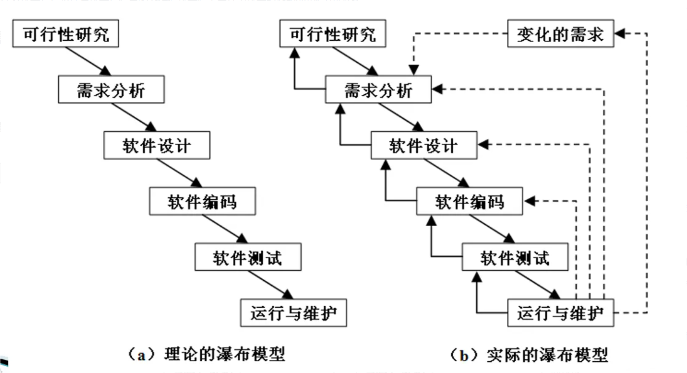

## 软件

**软件 = 程序 + 数据 + 文档**

>[!info] 软件
>软件不仅包含完成预定功能和性能的可执行程序，还包含让程序正常执行所支持的数据，以及与程序开发、维护和使用有关的文档。

### 软件的特征

- **抽象性**：软件是逻辑产物，而非物理实体。
- **可复制性**：软件的复制成本极低（几乎为零），且复制品与原品完全一致，没有磨损。
- **可演化性**：软件在其生命周期中会持续被修改 —— 修复缺陷、适应新环境、增加新功能。硬件的主要问题是磨损，而软件的主要问题是演化。
- **复杂性**：软件可能是人类创造的最复杂的实体之一。即使是小型应用，其内部状态和逻辑路径的数量也可能是天文数字。
- **无磨损性**：软件不会磨损、老化。
- **依赖性**：软件不能独立存在，它依赖于特定的硬件、操作系统、运行时环境（如 Java 虚拟机）和网络等。

>[!warning] 示例
>- Windows打补丁：可演化性
>- 开发时考虑不同的操作设备：依赖性

### 软件的分类

**一、按功能分类**
- 应用软件
- 系统软件
- 支撑软件

**二、按工作方式分类**
- 分时软件
- 实时软件
- 交互式软件
- 批处理式软件

**三、按服务对象分类**
- 项目软件
- 产品软件

**四、按软件规模分类**
- 微型软件
- 小型软件
- 中型软件
- 大型软件
- 超大型软件

**五、按软件服务对象分类**
- 通用软件
- 定制软件

**六、按源代码是否公开分类**
- 开源软件
- 闭源软件

>[!warning] 示例
>- 微信：应用软件、交互式软件、实时软件、产品软件
>- Linux：系统软件、分时软件、交互式软件、产品软件

## 软件危机

**软件危机的背景：**
1. **计算机应用扩展**：20世纪60年代，计算机从军事、科研领域扩展到工业、商业等领域，对软件需求激增且复杂度提高。
2. **软件规模扩大**：软件从小型程序发展为大型复杂系统，需多人协作开发，原有个体化开发方式无法适应。
3. **硬件发展迅速**：硬件性能提升快、成本下降，而软件生产效率低、质量难以保证，形成“硬件进步与软件滞后”的矛盾。
4. **缺乏系统方法**：早期软件开发依赖个人经验，无规范流程、工具和文档，导致开发过程混乱。

**软件危机的表现：**
1. 开发出来的软件产品不能满足用户的需求，即产品的功能或特性与需求不符；
2. 相比越来越廉价的硬件，软件代价过高；
3. 软件质量难以得到保证，且难以发挥硬件潜能；
4. 难以准确估计软件开发、维护的费用以及开发周期；
5. 难于控制开发风险，开发速度赶不上市场变化；
6. 软件产品修改、维护困难，集成遗留系统更困难；
7. 软件文档不完备，并且存在文档内容与软件产品不符的情况。

**软件危机出现的原因：**
1. 忽视软件开发前期的需求分析；
2. 开发过程缺乏统一的、规范化的方法论的指导；
3. 文档资料不齐全或不准确；
4. 忽视与用户之间、开发组成员之间的交流；
5. 忽视测试的重要性；
6. 不重视维护，或由于上述原因造成维护工作的困难；
7. 从事软件开发的专业人员对这个产业认识不充分，缺乏经验；
8. 没有完善的质量保证体系。

**软件危机的启示**：为了解决软件危机，人们开始尝试着用**工程化的思想**去指导软件开发，于是软件工程诞生了。（消除软件危机的途径：**管理 + 技术 = 软件工程**）

软件开发的核心目的 -> **高质量，低成本**

## 软件生命周期

**传统软件生命周期的各个阶段**：
- 可行性研究
- 需求分析
- 软件设计
- 编码
- 软件测试
- 软件维护

## 软件过程模型
### 瀑布模型

**实际的瀑布模型是带“反馈环”的**

瀑布模型优点：
1. 可强迫开发人员采用规范的方法（例如：结构化技术）；
2. 严格的规定了每个阶段必须提交的文档；
3. 要求每个阶段交出的所有产品都必须经过质量保证小组的仔细验证。

瀑布模型的缺点：
- 过于依赖书面的文档，很可能导致最终软件不能真正满足用户需要。

### 快速原型模型

### 增量模型

### 螺旋模型

### 喷泉模型

