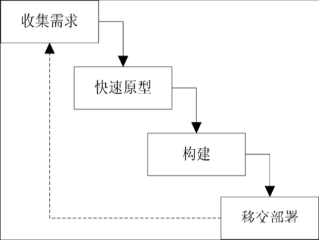
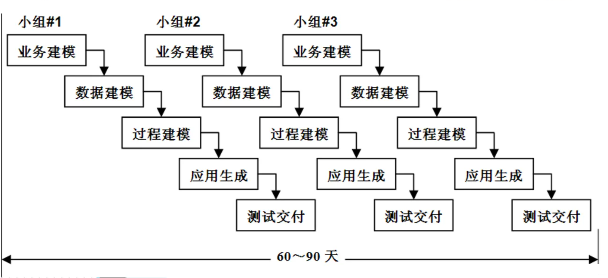
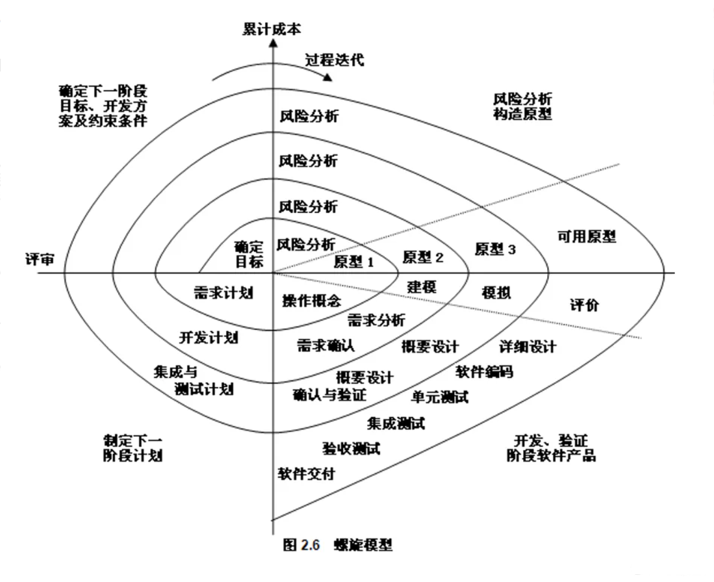
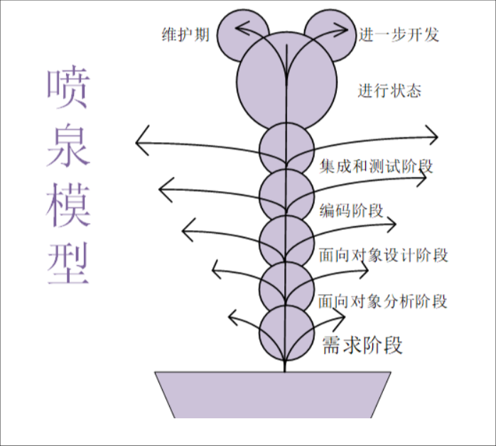

## 软件

**软件 = 程序 + 数据 + 文档**

>[!info] 软件
>软件不仅包含完成预定功能和性能的可执行程序，还包含让程序正常执行所支持的数据，以及与程序开发、维护和使用有关的文档。

### 软件的特征

- **抽象性**：软件是逻辑产物，而非物理实体。
- **可复制性**：软件的复制成本极低（几乎为零），且复制品与原品完全一致，没有磨损。
- **可演化性**：软件在其生命周期中会持续被修改 —— 修复缺陷、适应新环境、增加新功能。硬件的主要问题是磨损，而软件的主要问题是演化。
- **复杂性**：软件可能是人类创造的最复杂的实体之一。即使是小型应用，其内部状态和逻辑路径的数量也可能是天文数字。
- **无磨损性**：软件不会磨损、老化。
- **依赖性**：软件不能独立存在，它依赖于特定的硬件、操作系统、运行时环境（如 Java 虚拟机）和网络等。

>[!warning] 示例
>- Windows打补丁：可演化性
>- 开发时考虑不同的操作设备：依赖性

### 软件的分类

**一、按功能分类**
- 应用软件
- 系统软件
- 支撑软件

**二、按工作方式分类**
- 分时软件
- 实时软件
- 交互式软件
- 批处理式软件

**三、按服务对象分类**
- 项目软件
- 产品软件

**四、按软件规模分类**
- 微型软件
- 小型软件
- 中型软件
- 大型软件
- 超大型软件

**五、按软件服务对象分类**
- 通用软件
- 定制软件

**六、按源代码是否公开分类**
- 开源软件
- 闭源软件

>[!warning] 示例
>- 微信：应用软件、交互式软件、实时软件、产品软件
>- Linux：系统软件、分时软件、交互式软件、产品软件

## 软件危机

**软件危机的背景：**
1. **计算机应用扩展**：20世纪60年代，计算机从军事、科研领域扩展到工业、商业等领域，对软件需求激增且复杂度提高。
2. **软件规模扩大**：软件从小型程序发展为大型复杂系统，需多人协作开发，原有个体化开发方式无法适应。
3. **硬件发展迅速**：硬件性能提升快、成本下降，而软件生产效率低、质量难以保证，形成“硬件进步与软件滞后”的矛盾。
4. **缺乏系统方法**：早期软件开发依赖个人经验，无规范流程、工具和文档，导致开发过程混乱。

**软件危机的表现：**
1. 开发出来的软件产品不能满足用户的需求，即产品的功能或特性与需求不符；
2. 相比越来越廉价的硬件，软件代价过高；
3. 软件质量难以得到保证，且难以发挥硬件潜能；
4. 难以准确估计软件开发、维护的费用以及开发周期；
5. 难于控制开发风险，开发速度赶不上市场变化；
6. 软件产品修改、维护困难，集成遗留系统更困难；
7. 软件文档不完备，并且存在文档内容与软件产品不符的情况。

**软件危机出现的原因：**
1. 忽视软件开发前期的需求分析；
2. 开发过程缺乏统一的、规范化的方法论的指导；
3. 文档资料不齐全或不准确；
4. 忽视与用户之间、开发组成员之间的交流；
5. 忽视测试的重要性；
6. 不重视维护，或由于上述原因造成维护工作的困难；
7. 从事软件开发的专业人员对这个产业认识不充分，缺乏经验；
8. 没有完善的质量保证体系。

**软件危机的启示**：为了解决软件危机，人们开始尝试着用**工程化的思想**去指导软件开发，于是软件工程诞生了。（消除软件危机的途径：**管理 + 技术 = 软件工程**）

软件开发的核心目的 -> **高质量，低成本**

## 软件生命周期

**传统软件生命周期的各个阶段**：
- 可行性研究
- 需求分析
- 软件设计
- 编码
- 软件测试
- 软件维护

## 软件过程模型
### 瀑布模型

**实际的瀑布模型是带“反馈环”的**

**核心思想**：线性、阶段化开发，前一阶段完成后才能进入下一阶段。

**瀑布模型优点**：
1. 可强迫开发人员采用规范的方法（例如：结构化技术）；
2. 严格的规定了每个阶段必须提交的文档；
3. 要求每个阶段交出的所有产品都必须经过质量保证小组的仔细验证。

**瀑布模型的缺点**：
- 过于依赖书面的文档，很可能导致最终软件不能真正满足用户需要。

**瀑布模型应用场景**：
- 需求极其明确、稳定且可冻结：如编译器、操作系统内核、嵌入式控制系统。
- 技术非常成熟，风险极低。
- 有严格的法规或合同约束：需要完备的、可审计的阶段文档（如部分军工、航天项目）。
- 项目是 “再实现” 或 “移植”：例如，用新语言重写一个功能完全相同的旧系统。

### 快速原型模型

**核心思想**：快速构建可运行原型，与客户反复迭代确认需求，再进行正式开发。

**快速原型模型的优点**：
1. 快速验证需求，减少理解偏差，提升客户满意度；
2. 提前暴露技术风险，降低后期返工概率；
3. 适合需求模糊、用户体验敏感的项目（如交互类 App）。

**快速原型模型的缺点**：
- 原型易被当作最终产品，导致开发范围失控。
- 过度追求快速实现，可能忽略架构设计和代码质量。
- 反复迭代会增加开发时间和成本。

### 增量模型

**核心思想**：将产品拆分为多个可交付的增量模块，逐步迭代开发并交付。

**增量模型的优点**：
1. 早期交付核心功能，让客户快速获得价值。
2. 风险分散，单个增量失败不影响整体项目。
3. 灵活适应需求变更，可在后续增量中调整。

**增量模型的缺点**：
- 要求架构设计具备良好的可扩展性，否则增量集成会变得困难。
- 若增量划分不合理，可能导致模块间依赖混乱。
- 对项目管理和团队协作要求较高。

### 螺旋模型

**核心思想**：将开发与风险评估结合，循环迭代 “制定计划→风险分析→开发实施→客户评估” 四个阶段。

**螺旋模型的优点**：
1. 高度重视风险管控，适合大型、高风险项目（如航天、金融核心系统）。
2. 迭代式开发，可逐步完善需求和设计。
3. 客户全程参与，及时反馈，降低项目失败风险。

**螺旋模型的缺点**：
- 流程复杂，管理成本高，对团队能力要求极高。
- 风险评估环节耗时较长，可能延长项目周期。
- 不适合小型、短期项目。

### 喷泉模型

**核心思想**：面向对象的迭代开发模型，强调阶段间的重叠与迭代，像喷泉一样不断循环往复。

**喷泉模型的优点**：
1. 支持迭代开发，各阶段可重叠、反复进行，更贴合面向对象开发的特性。
2. 需求和设计可在开发中逐步细化，灵活性优于瀑布模型。
3. 强调无缝过渡，减少阶段切换的额外成本，提升开发效率。
4. 适合面向对象的软件项目，便于复用和维护。

**喷泉模型的缺点**：
- 阶段重叠导致管理难度大，对项目进度和文档管理要求更高。
- 若缺乏规范控制，易出现需求蔓延、开发范围失控的问题。
- 对团队的面向对象设计能力和协作能力要求较高。
- 文档完整性不如瀑布模型，不利于合规审计和后期知识传承。